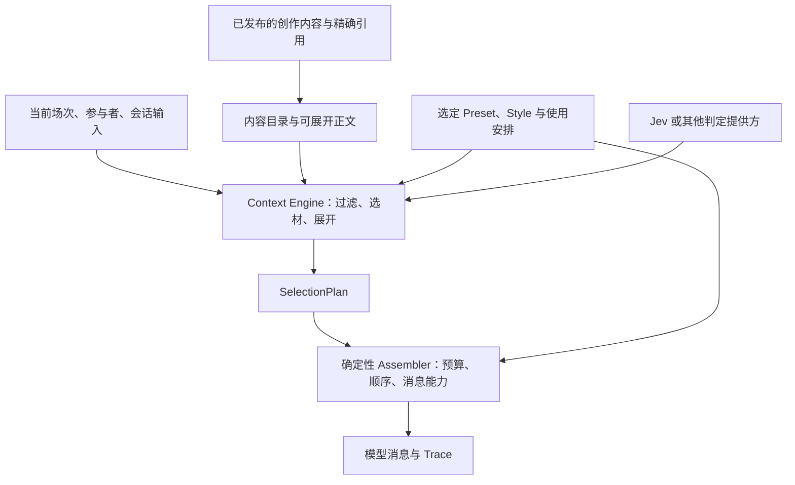

# 渐进式内容暴露与 Context Engine 契约：设计讨论稿

> **Superseded（2026-09-30）**：本文是讨论过程记录，现行规则以 [Char Story v1-draft](../../story-v1.md) 与 [DECISIONS](../../../DECISIONS.md) D-162 至 D-174 为准。文中“已确认”的取舍已按统一规范修订，二者冲突时以统一规范为准。

状态：**Proposed，未修改现行协议或实现。** 2026-09-26。

> **2026-09-26 更新**：用户已确认若干方向，以[总稿第 14.1 节](creative-platform-architecture.md#decisions-needed)为准：description 可挂在 Fragment、分组和作品三级，与激活方式解耦并计入 `semantic_digest`；Preset 可在新版本策略契约中覆盖 Module 块的位置和次数，去重只合并重复依赖路径，旧策略行为不变。本文与之冲突处以总稿为准。

完整讨论记录与全系统边界，统一见 [创作体系与系统架构总稿](creative-platform-architecture.md)。本文保留为渐进暴露与 Context Engine 契约的专项展开。

本轮用户明确提出两个设计要求：世界书等内容应支持先提供 description、按需要再展开；Preset、Style 等 Prompt 资产的组织必须考虑未来独立的 Context Engine。用户给出的 Jev 参考为 [TypeSafe 官方介绍](https://typesafe.ai/blog/introducing-system-one-models-and-jev)。

本稿在 [剧情创作内容模型](narrative-content-model.md) 之上讨论模型消费契约。Character、Scene、剧情线、时间线和资料的创作语义继续成立；Context Engine 组织这些内容进入模型，实际游玩仍属于独立 Runtime。本文没有调用 Jev，也未验证它在本项目中的选择质量、成本或延迟。

## 1. 当前实现提供了什么

| 当前实现事实 | 来源 | 对本次设计的影响 |
|---|---|---|
| Creation 有作品级 summary；Fragment 没有标准的 title/description/正文展开层级 | [creation.ts](../../../packages/core/src/schema/creation.ts) | 可读简介与可展开正文尚未构成条目消费契约 |
| 内容 IR 包含完整 fragments、来源和依赖实例；graph.nodes 保留作品名，没有传递作品 summary 的标准字段 | [ir.ts](../../../packages/core/src/schema/ir.ts)、[resolve/index.ts](../../../packages/core/src/resolve/index.ts) | Engine 不能只凭当前 IR 直接获得可供分层选材的目录；不能用从正文临时截取几句话来冒充作者提供的简介 |
| activation 支持 always/keyword/manual/semantic；参考实现的 semantic 依赖 manual_enabled，没有真实语义判断 | [activation.ts](../../../packages/assembler/src/activation.ts) | 已有激活入口，但没有模型选择过程 |
| pinned 在可见性过滤后绕过激活判断，成为必须保留的候选 | [assemble.ts](../../../packages/assembler/src/assemble.ts)、[activation.ts](../../../packages/assembler/src/activation.ts) | 不能把现有 pinned 直接解释为“被选中以后必须保留”；两种语义不同 |
| Assembler 同时进行可见性、激活、正文渲染、预算选择与消息输出 | [assemble.ts](../../../packages/assembler/src/assemble.ts) | 后续需要提供明确的选择结果输入边界；现有确定性渲染与预算逻辑可继续复用 |
| Style 是 Creative 作品，通过普通片段进入 system:style；正文内的提示语并不使它自动成为 Preset | [check.ts](../../../packages/core/src/check.ts)、[assemble.ts](../../../packages/assembler/src/assemble.ts) | 应保留作品表达意图与组装策略的区别，同时补充 Style 作用范围 |
| Preset 定义完整区域布局、预算、能力与字面块；Module 引用按依赖先于本地的顺序展开 | [policy.ts](../../../packages/core/src/schema/policy.ts)、[preset.ts](../../../packages/core/src/preset.ts) | 已有 Prompt 复用基础；导入顺序目前也参与最终内容顺序 |
| Preset 与 Module 共用 block 结构，位置限定 main/after-history；所有启用策略块计入固定成本 | [policy.ts](../../../packages/core/src/schema/policy.ts)、[assemble.ts](../../../packages/assembler/src/assemble.ts) | 模块复用与具体放置位置耦合，尚不能表达按用途在不同位置实例化 |
| manual_enabled 只参与 manual/semantic 的判定，不是整个 IR 的精确选择清单 | [activation.ts](../../../packages/assembler/src/activation.ts) | 不能把 Engine 的任意选择结果直接塞入 manual_enabled 就认为所有内容已受控 |
| 作者 fixture 验证固定输入下的消息、Trace 和组装错误 | [fixtures.ts](../../../packages/assembler/src/fixtures.ts) | 可以验证选择结果后的确定性组装；真实模型选材效果需要另一种评估 |

本轮 llmdoc delta 为 deep，但映射文档 0 impacted、0 needs-review，deep 信号来自未映射变更。以上依据当前源码核对，不能把历史草案中的“Module 尚未接入”继续当作现状。

## 2. 一个内容对象需要有可发现的入口

建议为需要按需消费的内容提供三个不同部分：

1. **简介与索引**：标题、description、相关主题/人物/地点、子项入口，使选择者知道这里有什么。
2. **可引用的正文**：有稳定身份、版本与来源的完整内容或明确内容单元。
3. **使用声明**：适用范围、需要时展开或在当前范围必须保留、必要的知情边界。

这是消费视图，不要求 Character、Scene、Lorebook、Style 变成同一种创作对象。作品级目录和条目级目录都需要身份与来源。分组只是可发现路径；同一条目被多处引用时仍应能认出它是同一内容。具有不同 bindings/override 的引用实例也不能只按原作 ID 合并。

作品页的 summary 和用于选材的 description 可以共用作者写的一段文字，也可以按需分别编辑；必须明确最终采用哪一份及其版本，不能无条件把宣传简介当成模型选材依据。编辑器可帮助起草 description，由作者确认后与正文一同发布。description 应描述覆盖范围、何时有用，不要求作者先知道某个模型的 Prompt 技巧。

description 默认是发现入口，不自动成为正文的等价替代。若作者希望同时提供“简版设定”和“完整版设定”，应将简版明确标为可用的内容表示，并说明哪些核心约束必须始终保留；Engine 不能自行截断正文就声称两者语义相同。

## 3. 世界书如何逐步展开

以“港城世界书”为例：

```text
世界书简介：港城的地理、主要势力、交通与地方习俗
    ↓ 当前对话涉及夜间进城
展开相关目录：城门、渡口、夜间通行制度
    ↓ 根据当前地点与玩家行动判断
读取必要正文：城门关闭时间、守卫查验方式
```

推荐的逻辑顺序是“先确定可用范围，再看简介，再展开候选，再决定正文纳入”。小型世界书可以直接使用条目简介，大型集合再增加分组；不强制所有内容走相同层数。

候选目录也占 token。不能把所有世界书的所有条目描述一次性塞给判定模型。Engine 应限制每层候选量、展开深度和总预算；直接场次引用、别名等也应能帮助找到条目，避免一段不够完整的父级简介成为永远无法绕过的筛选关卡。

本轮的渐进暴露主要指**模型看到的内容范围**。发布物可以仍保存完整依赖快照、客户端也可以预先下载；这与某轮只给模型提供少量内容并不冲突。按需网络下载是另一项优化，不能因此将精确 Release 内容变成运行时跟随 latest 的不稳定引用。

需要至少区别两种上下文：选材模型读的目录/候选资料，以及生成回复的模型读的最终内容。判定过程中读过一段正文，不意味着必须把它转发给生成模型。

## 4. Jev 在其中承担的职责

[TypeSafe 文档](https://docs.typesafe.ai/introduction) 将 Jev 定位为对给定 state 回答结构化问题的模型，而非自由文本生成器。其 Choice、Score、Noul 适用于不同判断形状；多个问题可以针对同一 state 独立评估。[Primitives](https://docs.typesafe.ai/primitives)

官方 [Skill suggestion 示例](https://docs.typesafe.ai/cookbooks/skill_suggestion) 展示了先依据目录简介筛选，再读取少量候选的详细描述与部分正文进行复核的流程。这可作为设计参照，但该示例最终最多选一个 skill；世界书经常需要同时纳入多条内容，不能直接照搬单选语义。

本项目的候选用法：根据当前场次、参与者、近期对话和条目描述，对每个候选判断其相关性与必要性，由 Engine 综合预算决定选取零条、一条或多条。可选内容允许全部不选。必需内容和知情边界由声明与程序检查决定，不依赖相关性分数。

可以先为每条候选使用明确定义等级的 Score，或询问“本轮理解/回应是否需要该条信息”的 Noul。Choice 用于确实互斥的类别选择。Noul 的 0.5 表示判断不确定，不是中等相关；Score/Choice 的 confidence 也不能被当作相关性值。具体阈值需在本项目样本上评估。[Confidence](https://docs.typesafe.ai/confidence)

同一阶段的独立判断可以批量提交；只有先得到筛选结果才知道下一批要读取什么时，才产生下一次依赖调用。Jev 不负责生成缺失简介、编写正文或替作者决定世界事实。其结构化输出仍须通过来源、允许范围和预算检查，类型正确不能证明判断正确。

Jev 作为首个候选选材提供方，依赖接口表达“判断/评分能力”；作者的作品不绑定 Jev 的型号、服务地址或凭据。未来可以使用其他模型或明确配置的规则策略。本文不依据厂商宣传数字承诺实际性能。

## 5. 内容描述和选择结果的候选契约

以下是逻辑字段，**不是现行 JSON Schema，也不是最终字段命名**：

```text
CatalogItem
  identity             精确作品版本、内容单元及引用实例
  kind                 character / lore-entry / scene / style 等语义
  title / description  有界、可用于发现的简介
  related              人物、地点、场次、主题等关联
  children             可按需继续展开的子项入口
  body_ref / digest    对应正文的稳定引用与内容身份
  usage                在本次组合中的作用范围与使用声明

SelectionPlan
  input_identity       内容锁、选定策略与本轮输入标识
  selector_identity    判定提供方及配置版本
  selected             明确的正文/简版引用及实例
  ranking              选择优先级；不等于最终消息顺序
  decisions            选择、拒绝、展开与回退的结构化记录
```

usage 应允许来自作品定义以及 Scenario 中的具体使用安排。例如同一条城门资料，在一般城市对话中按需出现，在“城门盘问”场次中可能是必须保留的前提。局部使用声明有来源与作用范围，不反写原条目。

现有 pinned 语义保持兼容。新设计若要表达“场次生效后，该条目必须保留”，应将资格/作用范围与保留强度分开表达，不通过改变旧 pinned 的含义达成。

在按角色隔离的消费模式中，筛选发生在 description 和正文暴露之前。目录标题或简介同样可能泄露秘密，不能只在最终正文上做过滤。全知旁白的候选视图与某个角色的候选视图可以不同，应由明确的消费模式决定。

SelectionPlan 中的引用必须属于获准的内容集合；不存在的 ID、错误版本、错误实例或越界内容不能交给渲染器。低置信度、服务不可用和预算不足的回退方式由选定策略明确，不能静默退回“全部注入”。

## 6. Preset、Style、Prompt Module 的组织

| 对象 | 建议职责 | 例子 |
|---|---|---|
| Style | 可复用的表达意图与示例 | 克制的悬疑叙述、简短对白、特定人物的说话方式 |
| Prompt Module | 可复用的模型指导块 | 留给玩家回应空间、按声明的角色知情范围扮演 |
| Preset | 引用模型指导块，并组织最终上下文的规则 | 内容区域、块的装配位置、保留规则、预算以及选择策略的声明 |
| Context Engine | 按内容和策略产生本轮选择与编排结果 | 简介筛选、展开、评分、预算协调、调用确定性组装器 |
| Runtime Profile | 实际模型和后端的执行能力 | 上下文窗口、消息能力、tokenizer 及判定提供方配置 |

角色知道什么由作品与会话定义。Module 可以要求模型遵循这项安排，但不持有另一份独立的事实定义。Style 可以以提示词形式提供给模型，仍然属于作者表达意图；不能仅因最终渲染成指令就合并所有资产类型。

### 6.1 描述、核心内容与扩展示例

Style、Module 也可有简介，使作者和 Engine 能找到合适内容。已明确选用的核心风格与必需指导应稳定纳入；较长示例或明确标为可选的技巧才适合按需展开。相关性判定不能在没有声明的情况下任意切换风格或删除核心约束。

### 6.2 内容块与装配位置

当前 Module 的每个块自带 main/after-history，便于现有参考实现，但限制同一内容在不同搭配中的使用。建议下一版区分“块的用途/正文”和“在某个 Preset 中的装配安排”。现有 position 可通过版本化适配作为默认安排保留，不能在当前版本里静默改义。

例如一个“保留玩家行动空间”的块可以被一个 Preset 放在主指导中，另一个 Preset 明确将其作为末尾提醒；具体选择、重复使用和顺序都要出现在已解析策略中。依赖遍历用于加载与验真；最终提示词排列应有可解释的装配语义，不能仅依赖偶然的 DFS 顺序。首轮仍可保留现有依赖顺序作为兼容默认。

### 6.3 Style 的作用范围

Style 可由 Scenario 或用户明确选择，并标注用于全局叙述、某个场次或某个参与者的发言。Preset 决定这类内容放在哪里，不需要复制其正文。选材阶段不自动改变这些显式选择。

多个 Style 在同一范围使用时需要明确组合顺序，以及本地安排是补充还是替换。自然语言风格之间的语义冲突不能靠“后一个文本自动赢”保证解决；编辑器需要展示实际组合供作者判断。具体组合字段仍待评审。

现有 Style 通过 Creative references 进入 IR，Preset 只能导入 Module。可先沿用这一路径，让 Engine 从内容视图获得已选 Style；若需要在作品内容图之外临时选择 Style，应新增显式的组合输入并保留其来源与锁，不能塞入无来源的 Session 字符串来绕过契约。

### 6.4 判定提示与回复提示

用于 Jev 相关性判断的说明，由 Engine 的选择策略与提供方适配器管理；回复用的角色、Style 与 Module 按最终布局进入生成上下文。两种用途需要明确，不能把回复提示词原样发送给判定模型就认为选择问题已定义。

若未来允许作者发布可复用的选材提示，应显式说明其阶段与输入/输出用途。当前讨论不引入任意工作流或任意代码执行。

## 7. 与当前 Assembler 的衔接



现有 Assembler 已有价值：可见性检查、来源追踪、整条预算与显式能力失败可保留。需要引入新的显式选择入口，逐步分离其内部激活与渲染职责；旧 assemble 输入继续走兼容路径。

选择优先级和最终消息位置分别处理。Jev 认为最相关的条目，不一定应该被放到整段提示词最后。Preset 决定布局，Assembler 对实际渲染后的成本重新核算；目录估算与模型返回分数不能代替最终预算检查。

发布阶段继续保持纯计算、无模型调用。运行期选择可以包含非确定性的模型判断，但固定 SelectionPlan、正文、Preset、Profile 和 tokenizer 后的消息组装应可重放。线上 Trace 应分别保留判定依据的身份与最终纳入/预算舍弃结果，避免把“模型选中了”误读为“模型最后看到了”。

## 8. 必须明确的预算与失败边界

- 选材输入和最终生成输入分别有预算；description 不是免费内容。
- 核心人物约束、当前场次前提和已启用的必需策略先保留。正文过大时明确失败或选择作者提供的合法简版，不截断后宣称语义完整。
- 一个候选的分数、置信度与代价是不同量。默认阈值和数量只是待实验参数，不写成全部作品通用的常数。
- 可选条目允许零命中；相关性候选不等于合法剧情分支，不改变作者的事实或剧情规则。
- 内容目录缓存与会话判断缓存分别标识：版本、引用实例和本轮输入变化均可能使先前结果失效。
- 新版 Trace 记录简介级、正文级等实际暴露层级、精确来源、判定配置及最终选择。模型不生成自由文本理由时，系统保存分数、问题版本和规则原因，不伪造“模型解释”。

## 9. 建议的演进顺序

1. **先确定内容契约。** 在现有内容身份之上补齐作者可读写的 description、正文入口、作用范围与使用声明；同时明确简介到条目到正文的引用方式。具体 schema 在本讨论通过后设计。
2. **定义 Context Engine 的窄输入输出。** 引入 Catalog 与 SelectionPlan 的原型契约；先使用固定选择结果演练，让当前 Assembler 可接收和解释这些结果。
3. **整理 Prompt 装配语义。** 保留 Preset/Style/Module 边界，明确块的用途、作用范围和装配安排；先做兼容适配，再扩展高级组合。
4. **接入 Jev 并做真实评估。** 用同一批作者合成场景比较规则基线与 Jev，观察漏选、误选、必要内容保留、token 成本和往返时间，再决定阈值与回退。模型调用不作为现有确定性发布测试的隐式依赖。

这四步不要求 char.pub 承担 Runtime 服务，也不要求先建全套剧情状态机。Context Engine 可以先专注于组织上下文，后续继续消费更丰富的场次与剧情结构。

## 10. 首轮可检查的例子

| 输入或情形 | 应当能表达或观察到的结果 |
|---|---|
| 对话与某本世界书无关 | 不展开该书正文；目录成本仍可见 |
| 简介相似的两个条目 | 可读取有限详情复核，保留两阶段的选择记录 |
| 多条资料共同有关 | 可同时选中，支持全部不选，不强制单选 |
| 本场必要规则被判为低相关 | 仍按明确的必要性声明保留 |
| 无权进入某角色上下文的秘密 | description 与正文均不向该角色选择视图暴露 |
| 一个 Style 核心说明短、示例很长 | 核心风格持续生效，示例按已声明策略展开 |
| 两个参与者有不同说话风格 | 分别关联其 Style，不能混成无作用范围的一段指令 |
| Jev 不可用或结果不确定 | 使用已声明的有界回退，并在 Trace 中说明 |
| 内容版本相同、选择结果不同 | 作品版本不变，运行选择记录不同 |
| 未改旧作品、继续调用旧 assemble | 保持既有激活、位置、预算和错误行为 |

上述是设计验收场景，本轮没有新增或执行实现测试。
