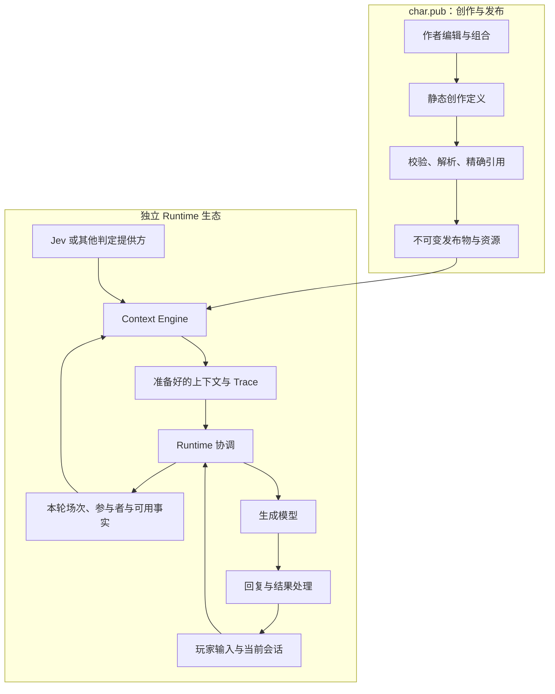

# char.pub 创作体系与系统架构：讨论记录及设计总稿

> **Superseded（2026-09-30）**：本文是讨论过程记录，现行规则以 [Char Story v1-draft](../../story-v1.md) 与 [DECISIONS](../../../DECISIONS.md) D-162 至 D-174 为准。文中“已确认”的取舍已按统一规范修订，二者冲突时以统一规范为准。

日期：2026-09-26。状态：**讨论稿 / Proposed**。

本文是这次架构讨论的统一入口，完整记录问题、回答的演进、已确认方向、候选抽象、当前实现边界及下一步工作。记录按主题与轮次整理，保留实质观点及修正，不逐字转录工具执行日志。

本文的“一等公民”指拥有明确身份与语义、可以被引用和编辑的对象；“基本原语”指组成创作模型的基础语义单位。二者都不自动意味着新增顶层作品类型、独立发布包或独立服务。

用户本轮明确要求先写文档。本文不构成开始实现的指令，不修改现有 schema、运行代码或公开协议。现有规范和 DECISIONS 中的已接受决定仍有效；具体替代决定需要后续明确记录。

## 阅读路径

- 要了解讨论为什么转向：读[问题与共识](#problem)及[逐轮记录](#discussion-record)。
- 要了解整体架构：读[系统抽象](#system-architecture)与作品的三个层次。
- 要评审一等公民与基本语义：读[一等公民](#first-class)和[基本原语](#primitives)。
- 要了解内容怎样组织和使用：读[剧情组织](#narrative-organization)、[渐进暴露](#progressive-disclosure)及[Prompt 组织](#prompt-organization)。
- 要明确运行职责：读[Runtime 边界](#runtime-boundary)。
- 要检查设计是否易于创作、分享、使用与参与：读[第 16 节](#ease-goals)。
- 要对照实现和继续评审：读[当前实现](#current-implementation)及[下一步](#next-steps)。
- 要了解已确认的具体方向：读[第 14 节](#decisions-needed)。

相关材料：

- [深度研究报告](ecosystem-research-summary.md)：生态和技术方案研究输入，其中的建议并非本项目已接受决定。
- [剧情创作内容模型草案](narrative-content-model.md)：人物、场次、资料与设定集的详细讨论。
- [渐进式内容暴露与 Context Engine 契约草案](context-engine-content-contract.md)：当前实现核对和消费契约讨论。
- [创作模型案例检验](narrative-model-cases.md)：用七个完整案例检验已确认方向，列出 35 项发现，作为收敛内容结构的输入。
- [剧情结构 v1 核心字段收敛稿](story-structure-v1.md)：`story` 块、参与者扩展、Scene、知情声明、条件语言 v1、Beat/结局/开局与投稿合并单位。
- [资料与 Prompt 组织 v1 收敛稿](content-and-prompt-v1.md)：description 位置、资料分组、参考资料、信息视角、地点、Style 作用范围与 Preset `"1-draft"`。
- [消费契约 v1](consumption-contract-v1.md)：Context Catalog、TurnView、SelectionPlan、Prepared Context 的结构，重放规则，以及雨夜旅馆的手工演练。
- [作者工作流 v1](author-workflow-v1.md)：新建、剧情工作区、预览、试玩、发布、投稿、Remix 与续作、共同创作、游玩沉淀与 agent 辅助。
- [DECISIONS](../../../DECISIONS.md)：已有决策；其中 D-161 记录本轮确认的平台与独立 Runtime 边界。

两份专项草案作为本文的展开材料保留。本总稿汇总当前讨论立场；未确认方案均应按建议阅读，不应从文档中的字段示例推断已实现能力。

<a id="problem"></a>

## 1. 我们在解决什么问题

最初的问题是：Character、Preset、Scenario 等对象看起来最终都成为提示词，平台为它们提供版本和复用之外，还能给创作者带来什么？分支、结局、选项、玩家跳脱预期、多角色参与，会不会改变整套内容抽象？

讨论逐渐明确了目标：char.pub 提供一个创作与发布环境，让作者选择自己喜欢的角色、世界、关系和资料，写出自己的剧情，并让这些创作可以被他人继续组合、改编和使用。发布物可以完全是静态定义。

AI 改变了作品被演绎的方式。人物、事件、场次、剧情线和时间线仍然有创作价值；作者可以给出框架、矛盾和重要发展，而将具体对白、行动及其细节留给玩家与 AI 共同完成。

用户参与之后可能影响后续事件，因此作品需要区分已经发生的背景、当前初始局面、作者期待的方向和可选发展。但这个需求不等于每段对话都必须事先写成有限状态机。

当前最需要回答的三个问题是：

1. 作者正在创作、引用和组合的究竟是什么？
2. 这些静态定义怎样完整地表达作者意图，并保留即兴空间？
3. 独立 Context Engine 与 Runtime 怎样消费这些定义，同时保持作品身份与作者意图可追溯？

## 2. 本轮共识与提案的状态

### 2.1 用户已明确的方向

| 编号 | 已确认方向 | 影响 |
|---|---|---|
| C-01 | char.pub 的重点是创作生态、内容组织和发布 | 创作工作流与可组合性是产品核心 |
| C-02 | 实际运行由独立 Runtime 项目负责 | 会话、模型调用和实际游玩不由 Registry 承担 |
| C-03 | 静态发布物应能包含剧情、分支选项、结局和多角色 | 内容模型不能只表达待拼接的提示词文本 |
| C-04 | 作者应能选择喜欢的角色来写自己的剧情 | 支持跨作品引用与本作品中的具体安排 |
| C-05 | 人物、剧情、时间线沿用创作者能理解的概念 | 从创作出发评审结构，而非从执行器倒推全部对象 |
| C-06 | AI 可以在大框架中发挥和推进 | 开放情境应当是合法、完整的创作方式 |
| C-07 | 从一开始考虑 description 优先的渐进式暴露 | 静态作品应提供简介、可展开正文及其关联 |
| C-08 | Preset、Style 等 Prompt 资产要为后续 Context Engine 组织上下文服务 | 创作语义与消费契约需要一起考虑 |
| C-09 | Jev 是用户指定的相关参考 | 本轮核对其结构化判定能力，未指定它为唯一实现 |
| C-10 | 先完整记录和评审架构，当前先不写实现代码 | 本轮交付物为文档 |
| C-11 | char.pub 类似面向创作者的 npm 与 GitHub；另有一套官方 agent runtime 让这些内容运行起来。官方 runtime 是默认、体验最好的消费端，内容契约保持公开，第三方 runtime 可以按契约消费（可能有损） | 设计同时服务发布协作与“一键运行”，但不绑定官方 runtime |
| C-12 | 整个体系要易于创作、易于分享、易于使用、易于参与创作；参与包括给别人的作品投稿、改编与续作、共同创作，以及把游玩沉淀为创作 | 每项结构设计都要按这四点检查，详见[第 16 节](#ease-goals) |

### 2.2 当前建议，尚未逐项批准

以下均为架构提案：Scene 默认作为 Scenario 内部对象；Lore Entry 与 Knowledge Source 分开命名；Beat 作为可选创作单元；描述目录与 SelectionPlan；Style 的作用范围；Prompt Module 的正文与装配位置分离。其中五项已由用户确认方向，见[第 14.1 节](#decisions-needed)。

已确认产品方向不代表这些具体表达已经定案。独立发布粒度、字段名称、严格条件语义、冲突规则、迁移和版本策略仍须评审。

### 2.3 已修正的思考

| 早期回答或假设 | 当前修正 |
|---|---|
| 先设计每轮剧情状态转移和运行控制器 | 先定义可发布的创作内容与消费契约；实际执行归 Runtime |
| 主要缺少 branch/ending 字段 | 需要先明确作品、人物安排、场次、资料与叙事组织的关系 |
| 所有故事都应先抽成可替换角色的模板 | 作者可以直接为具体角色写专属剧情；模板化是可选能力 |
| Knowledge 就是一条设定 | 还需区分参考资料、整理后的 Lore 条目及人物知情关系 |
| Lorebook 只是一组条目的集合 | 还需允许作者表达资料的适用范围与使用意图 |
| Scene/Plot 应普遍采用严格状态机 | 开放场次与可选转折先成立，严格规则按具体作品需要声明 |
| 完善创作模型后再考虑 Context Engine | description、正文入口和作用范围从第一版内容设计就要考虑 |

<a id="system-architecture"></a>

## 3. 更高层的系统抽象

建议把整个体系理解为三个相互协作的领域，再配上一套共同的身份与发布机制。

| 领域 | 关心什么 | 主要结果 |
|---|---|---|
| 创作定义 | 人物、世界、情境、事件、叙事安排及表达方式 | 可编辑、可组合的静态作品 |
| 上下文组织 | 本轮需要哪些内容、采用哪种表示、如何排列与分配预算 | 模型消息与可解释的选择记录 |
| 互动运行 | 玩家输入、实际发生的事情、人物当前状态、回复生成与呈现 | 一次具体游玩 |

共同的作品身份、版本、来源、许可、资源和引用，为前两个领域提供可追溯的输入。Runtime 自己持有实际会话及运行记录。

这些是逻辑职责，不要求对应多个服务。Context Engine 可以以独立库或服务形态实现，部署方式尚未确定。当前代码位于哪个仓库，也不自动决定其长期职责归属。

**官方 agent runtime 是 Runtime 生态中的默认消费端（C-11）。** 它与 char.pub 是两个项目，仍遵守“聊天流量不经过 char.pub”（D-055）：char.pub 负责搜索、解析 Release、下载产物与资源，官方 runtime 持有会话。它可以最早、最完整地实现条件语言 v1、知情控制和渐进选材，但这些能力都以公开契约定义，第三方 runtime 能按同一契约接入。

**规范归属与代码使用方需要分开看。** D-050 把 Runtime 边界放在 Resolver 与 Assembler 之间：Resolver 产出不可变的 Context IR，Assembler 每轮结合 Preset、Runtime Profile 和 Session 生成消息。按此划分，Assembler 与 Context Engine 在逻辑上位于 Runtime 一侧。但 `packages/assembler` 位于本仓库，char.pub 的作者确定性测试和创作预览也依赖它（D-160 第 5 条）。

建议：Context Catalog、SelectionPlan、Prepared Context 的**契约规范**由 char.pub 维护，与发布物格式一起版本化，因为它们决定静态作品怎样被消费；参考实现可以继续放在本仓库，供预览、作者测试和 Runtime 复用。Runtime 可以换用自己的 Engine 实现，只要遵守同一契约。本稿中的“内容适配层”指这份参考实现里把 Release 转成 Catalog 的部分，不是另一方持有的服务。



Context Engine 会做动态选择，但不因此拥有修改故事事实的权威。一次选材得到“某条资料相关”，不等于剧情中某个角色已经知道该资料。

## 4. 作品的三个层次

建议区分“原始创作”“本作品中的使用安排”“一次游玩的实际实例”。

| 层次 | 例子 | 持有者 |
|---|---|---|
| 可复用创作定义 | Alice 谨慎、善于观察，有自己的背景经历 | Character 作者 |
| 剧情作品中的安排 | 本剧目中 Alice 是旅馆老板，想保护昨夜离开的旅客 | Scenario 作者 |
| 一次实际游玩的状态 | Alice 已向这名玩家透露后门位置 | Runtime 的 Session |

第一层可以跨作品引用，第二层使复用的内容在具体故事中具有意义，第三层承载真实互动的变化。局部改编应保留来源和作用范围；不能在不知情的情况下改写原作。

发布状态、作者协作和作品版本也属于静态创作的生命周期，但不同于故事内部时间。新的作品 Release 不会自动替换已经开始的会话；是否升级、如何处理由 Runtime 和用户显式决定。

<a id="first-class"></a>

## 5. 一等公民与发布粒度

### 5.1 三种“一等性”

第一种是**可独立发布的作品**：有作者、稳定身份、Release、许可、来源和独立复用价值。

第二种是**作品内部有明确语义的对象**：有稳定局部 ID，能被编辑、引用、比较和解释，但默认跟随所属作品发布。

第三种是**运行实例**：对应本次会话中的参与者、状态、事件和记忆，由 Runtime 创建和维护。

把它们都做成顶层 Creation，会增加作者必须管理的作品数量；全部藏进文本，又会失去可组合性。建议先赋予重要对象稳定的语义和引用能力，再按独立复用需要决定是否单独发布。

### 5.2 现有九类作品的定位建议

当前实现已经支持九类 Creation。以下表格重述职责，不代表删除、合并或新增类型已经获准。

| 作品类型 | 当前讨论中的职责 | 需要守住的边界 |
|---|---|---|
| Character | 可复用的人物定义 | 具体剧目里的临时处境不自动成为原人物设定 |
| World | 世界背景、规律及其关联内容 | 世界本身与一册整理资料不必一一对应 |
| Lorebook | 作者整理的设定条目集合及使用声明 | 引入资料不代表全部角色知情或每轮全部注入 |
| Relationship | 可复用的关系设定或关系模板 | 区分关系原型、人物之间的具体关系、实际游玩中的变化 |
| Scenario | 剧情作品与组合入口 | 可以是开放起点、单场次或多线剧情，不强制完整预写分支 |
| Persona | 玩家使用的身份定义 | 与 Character 可共享部分描述结构；由玩家控制属于参与安排，具体统一方式待评审 |
| Style | 可复用的表达意图与示例 | 文风及人物声音有作用范围，不持有另一份故事事实 |
| Preset | 上下文装配和模型指导的组织规则 | 不能修改作者设定；这是 D-028 已接受的规则（Preset 永远不能修改 Creative Truth） |
| Prompt Module | 可复用的指导内容 | 明确用途与来源，不要求每个文本块单独发布 |

### 5.3 建议成为内部语义对象的内容

| 对象 | 意义 | 初步粒度建议 |
|---|---|---|
| Scene | 一段具体互动情境 | 默认属于 Scenario |
| Beat | 一次希望探索的剧情变化或关键转折 | 默认属于场次或剧情线 |
| Plotline | 围绕某个冲突、目标或人物变化组织内容 | 默认属于 Scenario，引用场次和节拍 |
| Event | 故事世界中的事件定义 | 可属于 World 或 Scenario |
| Timeline | 对事件时间与顺序的安排或视图 | 引用事件，不复制事件正文 |
| Cast / Participant binding | 人物在本作品中的参与身份与安排 | 归所属 Scenario |
| Lore Entry | 作者整理的一条设定信息 | 默认归 Character、World、Lorebook 或 Scenario |
| Knowledge Source | 参考文档、资料及来源 | 先作为作品关联资源；是否独立发布待定 |
| Location / Item 等 | 有身份的地点或物件 | 需要引用时结构化，不一次性增加全部顶层类型 |
| Prompt Block | 有稳定身份的提示内容单元 | 跟随 Module 或 Preset 发布 |
| Asset | 图片、音频等资源及其来源信息 | 复用现有资源能力，使用方式由关联声明表达 |

### 5.4 Runtime 的一等实例

Session、实际参与者实例、当前知情与关系、实际事件、对话历史、记忆、实际场次、游玩分支、模型配置与调用记录属于 Runtime。

Context Engine 的内容目录是对静态发布物的消费视图；SelectionPlan 和 Trace 是某次运行的记录。它们不会因有名字就成为用户必须发布的作品。

<a id="primitives"></a>

## 6. 基本原语与最小语义

这部分回答“这些对象靠什么组合”。建议先确定语义，暂不选择最终 JSON 字段或 DSL。

| 基本原语 | 需要表达什么 | 示例 |
|---|---|---|
| 身份与引用 | 稳定地指出某件作品、局部单元或使用实例 | 某一 Release 中的后门条目 |
| 正文与描述 | 内容本身，以及用于发现用途的 description | 后门设定正文及一行用途介绍 |
| 使用与绑定 | 在哪个作品中、以什么角色使用某项创作 | Alice 担任本故事的旅馆老板 |
| 关联 | 对象之间有明确意义的联系 | 人物参与场次、条目关于地点、人物之间有关系 |
| 组织 | 集合、层级、顺序和并行关联 | 设定集分组、剧情主支线、事件先后 |
| 作用范围 | 这项安排对哪个世界、时期、场次或参与者成立 | 本场 Alice 的目的；某年代适用的世界规律 |
| 陈述与视角 | 作者设定、人物的说法、传闻及其来源 | “居民认为后门闹鬼”与“后门确实闹鬼” |
| 意图与约束 | 期待探索的方向、可能发展、明确要求 | 希望逐渐建立信任；不能提前知道某事实 |
| 表达与呈现 | 如何叙述、用什么声音、使用哪些媒体 | 旁白克制，Alice 的发言有幽默感 |
| 来源与局部改编 | 来自哪里，在本作品内调整了什么 | 引用角色原作，新增本场目的并记录来源 |

正文允许自然语言。人物性格不必强制转成枚举，信任不必统一为数值，时间不必一开始就精确到日期。身份、引用、集合和作用范围需要机器可理解的结构；复杂含义可以由文本和作者说明承载。

明确约束与创作意图也要分别表达。定义一个要求，不等于运行端一定能保证模型遵守；消费契约需要说明支持能力和验证方式。不能把“按需相关性判断”同时当作知情授权、剧情推进和事实确认。

### 6.1 需要分别定义的关系图

| 关系图 | 含义 | 约束不能相互套用的原因 |
|---|---|---|
| 发布依赖图 | 使用了哪些精确版本的外部作品 | 处理闭包、版本和来源 |
| 人物与世界关联 | 谁与谁有什么关系，谁在何处参与 | 互相关联是正常创作关系 |
| 叙事组织 | 场次、转折及可能发展怎样连接 | 返回某个地点或场次可以是合法叙事 |

现有依赖图禁止环，不意味着剧情不能回到之前的局面。现有单图单版本规则可继续保障当前解析；它在更丰富的角色变体组合下是否过严，需要实例评审，不能自动放宽或宣布永远适用。

<a id="narrative-organization"></a>

## 7. 人物、资料与剧情如何组织

### 7.1 Character 与本作品中的人物

Character 的低门槛入口可以是名字与一段介绍。外貌、性格、动机、背景、表达方式、示例对白是可选栏目，既帮助作者思考，也帮助消费端理解内容用途。自定义章节可保留，但核心关联不能只依赖解析标题猜测。

人物的长期动机可以属于 Character；某场戏的临时目的属于本作品的安排。判定依据是适用范围，不应机械规定某一类词永远归某字段。

现有机制已经能表达一部分本地安排：Scenario 可以通过 Fragment Override 在被引用人物的语境中 `add` 一段新内容，或对稳定片段做 `replace`/`remove`/`patch`；替换 intrinsic 设定必须显式 `force` 并在来源中标记 `au: true`（D-027、D-028）。所以“Alice 在本剧是旅馆老板”今天可以写成追加给 Alice 的一段文本。缺口在于这段安排只是一段文本：它没有“本作品中的角色身份”“本场目的”这类可引用语义，无法指明只在某个场次成立，同一原作的两个使用实例也难以区分。新设计应在 Override 之上补这些语义，而不是另建一套改编机制。

多角色作品需要直接表达参与者，而不只使用一对 user/assistant 名称。一个公开 Character 可以在不同作品中有不同安排；同一作品中的同名人物、同一角色的不同使用实例也要能明确区分。

作者可以先挑选 Alice 和 Bob 再为他们写剧情。是否把“证人”做成可替换的角色位置，由作者决定。替换角色也不保证新人物天然符合原剧情，需要让作者看清哪些前提受影响。

### 7.2 Knowledge、Lore Entry 与 Lorebook

| 层次 | 建议内容 | 例子 |
|---|---|---|
| Knowledge Source | 原始或长篇参考资料、来源、版本和可引用定位 | 《旅馆建筑与历史》 |
| Lore Entry | 作者整理的信息正文及相关对象 | 后门通向河边小路 |
| Lorebook | 条目集合、组织及使用声明 | 旅馆的建筑、历史与传闻资料集 |
| 人物知情安排 | 人物与信息在特定范围内的关系 | 开场时 Alice 知道，玩家不知道 |

这是候选概念，不是已有行业统一命名。现有 `fragment.kind = knowledge` 仍然表示既有知识片段，不应在一次字段更名中被重新解释为长篇资料。

条目可以原创，也可以指向资料出处；原始资料可以直接供 Runtime 查询，无需强制先转成 Lorebook。来源包含某个说法，也不自动意味着本作品采纳其为事实。

Lorebook 的正文、条目的相关性线索、在本作品中的用途都需要有位置。例如“涉及后门时有用”“本场一直重要”“开场只被 Alice 知晓”是不同声明；关键词命中不会使角色在故事中自动获得知识。

同一条权威正文尽量只编辑一处。人物背景、设定集与场次通过引用使用它，允许有明确标注的摘要或本地改编，避免多个副本悄悄互相矛盾。

未声明某个角色是否知情，不自动等于声明他不知道。角色的信念、作者确定的背景以及当前会话已经确认的事实也不必完全一致，结构需要保留其来源和视角。

### 7.3 Scene、Beat、Plotline、Event 与 Timeline

- **Scene** 描述一段情境：时间、地点、参与者、开局局面、人物目的、矛盾和相关资料。
- **Beat** 表达关键变化：发现矛盾、产生怀疑、建立初步信任、面临抉择。它可以只说明作者希望探索的变化，不指定台词。
- **Plotline** 围绕一个冲突或变化组织场次和节拍。一个场次可以同时推进主线与人物线。
- **Event** 表达世界里的一件事。它可能是已经发生的背景，也可能是作者安排的未来事件；两者要能区分。
- **Timeline** 表达事件时间、顺序或并行关系。作品的讲述顺序可以不同于事件发生顺序。

例如“昨夜有人离开旅馆”是事件，“今晚在大厅追问”是场次，“玩家开始怀疑老板的说法”是节拍，“追查失踪者”是剧情线。玩家可能今晚才得知昨夜的事件，所以时间先后与信息揭示顺序不能合成一张无区别的列表。

Timeline、剧情线和关系视图可以共用同一组对象。把一个场次显示在两条线上，不应复制出两个互不关联的正文。

### 7.4 分支、选项、结局与跳脱行为

本轮最初提出的四个问题仍需覆盖，但应放在创作语义中定义。

| 内容 | 静态作品可以定义 | Runtime 负责 |
|---|---|---|
| 剧情分支 | 可能方向、适用局面、明确前提或自由描述 | 判断本次互动是否走向某个方向并记录结果 |
| 选项 | 作者建议的行动、用于进入故事的身份或开场选择 | 展示选项、接收自由输入，执行相应交互规则 |
| 结局 | 收束主题、候选结果、明确触发要求或结束意图 | 判定本次是否达成、生成收束，处理继续游玩 |
| 跳脱预期 | 哪些前提应保持、哪些部分允许改编、作者可选的引导建议 | 理解输入、处理偏离、维护实际状态与用户体验 |

不要求每个 Scene 都有以上全部结构；没有选项和预写结局的开放情境也应能发布。相关字段的“建议”“可能”“必须”需要有不同语义，不能仅凭它出现在数组里就认为必须顺序执行。

还应区别三种 branch：作者设计的剧情分支、Runtime 的游玩分支/回退点，以及作品版本管理中的分支或 Remix。它们的身份、历史和合并方式不同。

严格条件是可选创作能力：开放情境无需写任何条件。首版声明式条件的事实类型、组合方式、变量效果、求值责任与冲突处理见[第 14.2 节](#decisions-needed)，其中“条件语言 v1”是收窄后的建议。

<a id="progressive-disclosure"></a>

## 8. 渐进式暴露应成为内容契约

用户明确希望“先暴露 description，需要时再用 Jev 等模型判断并加入内容”。这要求静态作品提供可发现入口，不能等 Runtime 拿到一整段正文后才临时猜测该怎样拆。

### 8.1 三类信息

每个需要按需取用的内容单元，候选结构应能表达：

1. 身份、标题、description、相关主题，以及可继续展开的子项。
2. 完整正文或作者明确提供的简版内容，附稳定引用与来源。
3. 在本次组合中的作用范围、必需程度、知情或展示边界。

description 解释这里包含什么、何时可能有用；它默认不承担替代完整设定的职责。如果要让生成模型直接使用简版设定，应由作者明确提供这种表示，不能把截断正文误当作语义等价的摘要。

作品页简介与选材 description 可以共享文字，但需要允许作者按用途完善。选择依据与正文都应跟随版本，不能发布后由未记录的模型输出暗中改变。

据此建议 description **计入 `semantic_digest`**：修改简介会改变选材结果，应当产生新的 Release 身份；否则“选择依据跟随版本”无法成立。代价是作者只改简介也要重新发布，这与“版本号只是 label，锁定靠 digest”的现有规则（D-040）一致。

现有 `activation: { mode: "semantic", hint?: string }` 可以看作片段级 description 的雏形，但它不够用：它只在 semantic 激活时存在，不能用于 always/keyword 片段的目录展示；它表达的是“检索提示”，不是面向作者和判定模型的用途说明；集合和分组也没有对应位置。建议新增独立的 description，与激活方式解耦；旧的 `hint` 在适配时可作为 description 缺省值，但不反向改写旧 Release。

### 8.2 分层读取

```text
整本世界书的 description
    ↓ 判断与当前情境相关
相关分组或条目的 description
    ↓ 判断具体需要哪些信息
少量正文或合法简版
    ↓ 根据预算和布局
进入最终生成上下文
```

小型资料集可直接提供条目简介；大型集合再引入层级。作者直接关联的本场资料，可以走明确引用入口，不必重复被模糊简介筛掉。

目录本身也有成本，因此候选数量、展开层数、总读取量和最终输入预算应有边界。没有条目相关时允许不展开任何正文。实际下载完整发布包，与本轮只向模型暴露少量内容，是两个不同问题。

### 8.3 四项判定不能混为一谈

| 判定 | 依据 |
|---|---|
| 是否允许看见 | 访问权限、消费模式、参与者与信息边界 |
| 是否适用于当前局面 | 当前场次、时间、参与者及作者声明 |
| 是否与本轮相关 | 直接引用、规则、检索或 Jev 等模型判断 |
| 最终能否放入上下文 | 必需内容、完整渲染成本、预算与消息能力 |

在按角色隔离的模式中，过滤应早于目录与正文暴露；标题和 description 同样可能透露秘密。全知叙述者视图与某角色视图可以不同。这里的知情安排与 Registry 对读者的作品访问权限也是两回事。

这建立在已接受的 D-053 之上：Runtime Profile 声明 `mode: narrator | per-agent`；`per-agent` 下 visibility 可以作为隔离边界，`narrator` 下它只是“扮演某角色时不应使用此信息”的提示，不是安全边界。Fragment 已有 `visibility`（`shared`、`private` 指定角色、`scene` 指定场次）。新设计要补的是：知情起点和信息视角（传闻、人物说法），以及目录阶段也按 visibility 过滤；不是重新定义可见性。

“给模型逐步取用资料”和“故事逐步向玩家揭露秘密”应分别处理。检索到一条资料，并不授权模型让角色提前说出它。

<a id="prompt-organization"></a>

## 9. Prompt 资产与 Context Engine

### 9.1 职责分工

| 对象 | 回答的问题 |
|---|---|
| Style | 作品或人物希望怎样表达？ |
| Prompt Module | 哪些模型指导可以被独立复用？ |
| Preset | 使用哪些指导，按什么顺序、位置和保留策略组织上下文？ |
| Context Engine | 这一轮具体选择哪些内容，并怎样准备完整输入？ |
| Runtime Profile | 实际使用的后端具备什么能力和限制？ |

Style 是作者的表达意图，即使最终渲染成提示语，也不自动与 Preset 合为一个对象。角色口吻、叙述文风、模型输出格式和上下文预算分别有自己的用途。

### 9.2 内容与装配安排

Prompt Module 的核心是有稳定身份的指导内容。某个 Preset 如何使用它，应有明确的装配安排，包括作用范围、位置与顺序。当前实现中块自带 main/after-history，作为兼容默认可以保留；若以后支持覆盖，需要版本化契约。

例如“给玩家留下回应空间”的同一指导，可以在不同搭配中放在主指导或末尾提醒。依赖顺序用于加载与验真，最终提示顺序需要可解释；不应把偶然遍历顺序提升为所有未来组合的唯一语义。

模块去重也需要区分“同一依赖被多条路径引用”和“作者明确在两个位置使用同一块”。目前按 Release 去重的语义不能未经评审就静默改变。

例如 Preset P 引用 Module A 和 B，A、B 都依赖“留给玩家行动空间”模块 M：M 只应注入一次，这正是现行“同 Release 只注入一次”规则（D-160 第 2 条）要处理的情况。另一种情况是作者有意把 M 同时放在主指导和末尾提醒：这是两次装配，不是重复依赖。现行规则会把后者也合并成一次，因此开放显式装配时需要修订去重规则，并按策略版本区分新旧行为。

### 9.3 Style 的作用范围

Style 可以针对全局叙述、一个场次或某个人物。叙述者克制与某个角色夸张可以同时成立，只要范围明确。

同一范围叠加多个 Style 时，作者需要看见顺序和本地安排是补充还是替换。自然语言矛盾不能简单依赖后文覆盖前文来保证解决。首轮可强调显式选择与可预览的组合，精细冲突语义待评审。

已选 Style 的核心说明、必需模型指导应稳定保留；长示例和明确标记的可选内容可以渐进展开。不能把所有 Prompt 都丢给相关性模型任意取舍。

### 9.4 选材提示与回复提示

判定模型读的是相关性问题、当前情境和候选资料。生成模型读的是选定角色、场次、Style、指导块以及会话内容。两类提示的目的和输入不同。

Preset 可以声明选材策略的要求，Context Engine 的适配器管理如何向具体提供方提问；是否允许独立发布“选材 Prompt”尚待讨论。当前不需要因此引入通用工作流执行语言。

## 10. Jev 与上下文准备的候选流程

Jev 的官方文档（本节外部事实均于 2026-09-26 查阅，未在本项目中实测）描述了根据给定 state 回答结构化问题的能力。Choice 适合互斥选择，Score 适合明确定义的等级判断，Noul 表示某命题为真的概率。它们提供的是判断结果，而非新的设定正文。[TypeSafe Introduction](https://docs.typesafe.ai/introduction)、[Primitives](https://docs.typesafe.ai/primitives)

官方 Skill suggestion 示例采用简介筛选与详情复核两步，可以参考其渐进取用方式；本项目的世界书通常需要多选，不能直接复制该示例“最多一个 skill”的选择语义。[官方示例](https://docs.typesafe.ai/cookbooks/skill_suggestion)

推荐的准备过程是：

1. Runtime 提供当前场次、参与者、会话摘要或相关历史及已确认事实。
2. Engine 按声明过滤不可用内容，形成有界的目录。
3. 通过直接引用、规则或 Jev 评估候选；必要时读取少量详情再次判断。
4. 产生明确选择结果，记录精确内容身份、采用的表示、评分与配置身份。
5. 确定性 Assembler 按 Preset 渲染，复核预算和能力，输出消息与 Trace。
6. Runtime 负责调用生成模型及处理其结果。

这些步骤描述职责，不要求每轮都调用判定模型或都经过同样数量的网络请求。独立判断可以批量进行，依赖前一步新读取资料的判断再分阶段。

候选契约如下，名称尚未定稿：

| 契约 | 提供者 → 消费者 | 主要信息 |
|---|---|---|
| 已发布定义与资源 | char.pub → Runtime/Engine | 作者内容、结构、资源、引用与精确版本 |
| Context Catalog | 内容适配层 → Engine | description、关联、正文入口、来源与范围 |
| 本轮会话视图 | Runtime → Engine | 当前参与者、场次、已确认状态及需要使用的历史 |
| SelectionPlan | Engine → Assembler | 选定内容及表示、排序依据、输入与策略身份 |
| Prepared Context | Assembler → Runtime | 最终消息、附件和 Trace |

选择优先级不等于最终消息位置，目录阶段的 token 估算也不等于最终成本。固定选择结果、正文、策略和执行配置后，应能重放组装过程；固定它们不保证生成模型给出相同回答。

Score/Choice 的 confidence 与相关性分数不同，Noul 也没有独立 confidence 字段。阈值需要在本项目数据上检验。结构输出合法仍可能判断错误，因此允许空选择，并需要明确服务不可用、不确定和预算不足时的有界回退。[Confidence 文档](https://docs.typesafe.ai/confidence)

Jev 是可替换的判定提供方。作品定义不绑定它的服务地址、凭据或型号；本轮未调用模型，未验证实际质量、成本或延迟。厂商案例作为机制参考，不作为本项目的性能承诺。

<a id="runtime-boundary"></a>

## 11. 哪些事情属于 Runtime

| 事项 | char.pub / 静态定义 | Context Engine | Runtime |
|---|---|---|---|
| 人物与世界 | 发布作者设定、引用与本地改编 | 选择和表达当前需要的部分 | 维护本次人物实例 |
| 剧情安排 | 发布场次、转折、选项、结局、初始条件与意图 | 消费当前已确定局面，准备相关内容 | 解释行动、确认实际发展、进入或离开场次 |
| 时间线 | 发布背景事件与计划安排 | 取用当前时点适用的信息 | 记录实际经过的时间与事件 |
| 知情与关系 | 声明起点和适用范围 | 按消费模式提供正确内容视图 | 更新本次谁知道什么、关系如何变化 |
| Lore 与参考资料 | 发布可发现、可引用的内容及使用声明 | 检索、展开、选材和预算 | 提供本次有效范围与相关状态 |
| Prompt 和 Style | 发布内容与策略定义 | 解析已选搭配并装配消息 | 选择实际后端和用户配置 |
| 玩家输入与回复 | 可提供开场及作者建议 | 接收本轮输入视图 | 接收输入、调用生成模型、呈现回复 |
| 历史与记忆 | 可发布合成例子或明确的策略定义 | 消费 Runtime 提供的记忆与历史 | 保存真实记录、执行摘要与记忆更新 |
| 分支、回退、重生成 | 提供作者设计的可能发展 | 为指定分支准备上下文 | 维护实际分支和恢复状态 |
| 工具与插件 | 可声明所需能力，执行组件另行评审 | 按契约组织允许使用的上下文 | 执行外部工具、处理副作用与权限 |
| 验证 | 静态引用、结构、发布完整性、确定性 fixture | 选择记录与上下文准备的检查 | 真实互动、生成质量及行为评估 |

Context Engine 首版的职责是准备上下文。若某次模型判断被用来提议剧情变化，确认与落地仍应由 Runtime 的会话控制承担；不能让一次相关性评分直接改写剧情事实。

char.pub 不必保存用户的真实聊天才能提供创作预览。作者主动构造的合成场景、目录展开演练和确定性消息预览足以检查许多内容问题。真实游玩数据的持有与发布应分别处理。

<a id="current-implementation"></a>

## 12. 对照当前实现

本节以本轮实际阅读的工作区源码与规范为依据，描述实现结构；没有重新执行全量测试，也不构成线上验收结论。

| 部分 | 当前已有 | 本轮识别的缺口或待评审调整 |
|---|---|---|
| 作品与发布 | 九类 Creation、不可变 Release、精确引用、来源、许可与统一产物 | 保留基础；内部语义对象的粒度需要补充 |
| 人物组合 | cast、slots、bindings、params 和引用实例 | 作品角色身份、本地安排及同一原作多实例需要更明确的语义 |
| 局部改编 | Edge / Scenario 两层 Fragment Override（add、replace、remove、patch），intrinsic 替换需 force 并标记 `au: true` | 能追加文本，但追加内容没有“本作品中的身份”“本场目的”等可引用语义和场次范围 |
| 可见性与知情 | Fragment `visibility`（shared、private、scene），Runtime Profile 的 narrator / per-agent 模式 | 缺少知情起点、信息视角与目录阶段的过滤契约 |
| 内容正文 | Fragment 支持文本、对白、媒体和 structured 数据 | 自由结构透传不等于已有场次、节拍或事件标准 |
| 资料组织 | Lorebook 以 knowledge fragments 承载条目 | 原始资料、条目目录、关联及使用意图仍不完整 |
| 渐进暴露 | 作品级 summary，片段激活与优先级，semantic 激活的可选 `hint` | 缺少与激活方式解耦的片段级 description、展开入口和标准目录视图 |
| IR | 完整片段、依赖实例、来源、参与者、资产 | 作品 summary 未作为标准目录传递；完整创作结构不应被限制为模型消息的中间形态 |
| 语义选材 | semantic 枚举及 manual_enabled | 参考实现没有语义检索或 Jev 判定；manual_enabled 也不是完整内容白名单 |
| Preset | 字面指导块、完整区域布局、区域预算和能力要求 | 块用途与具体位置的耦合、选择策略与阶段仍需设计 |
| Prompt Module | 独立发布、精确导入、来源、去重与依赖顺序 | 导入遍历与最终装配顺序、重复使用的语义需评审 |
| Style | 独立 Creative 类型及 system:style 区域 | 对叙述、场次或参与者的作用范围尚不充分 |
| Assembler | 可见性、激活、渲染、预算与 Trace | 后续增加显式选材结果入口，保留现有确定性能力 |
| 测试与预览 | 固定输入的 assembly fixture、消息摘要及 Trace 断言 | 模型选材效果需独立评估，不能伪装成确定性发布检查 |

对应证据入口：

- [Creation 与 Fragment schema](../../../packages/core/src/schema/creation.ts)
- [Context IR schema](../../../packages/core/src/schema/ir.ts)
- [统一发布产物 schema](../../../packages/core/src/schema/artifact.ts)
- [引用绑定环境](../../../packages/core/src/resolve/env.ts)
- [内容 Resolver](../../../packages/core/src/resolve/index.ts)
- [Preset / Module schema](../../../packages/core/src/schema/policy.ts)
- [策略解析](../../../packages/core/src/preset.ts)
- [激活实现](../../../packages/assembler/src/activation.ts)
- [Assembler](../../../packages/assembler/src/assemble.ts)
- [作者 fixture](../../../packages/assembler/src/fixtures.ts)
- [现行 Canonical Model](../../canonical-model.md)、[Preset 规范](../../preset-v0.md)、[组装资产契约](../../assembly-assets-v0.md)

### 12.1 与已接受决策的关系

本稿的若干方向已被现有决策部分覆盖。后续设计应在这些决策之上扩展，除非明确记录替代决定：

| 已接受规则 | 与本稿的关系 |
|---|---|
| D-027：intrinsic 依赖是身份的一部分，替换时必须选择 Remix 或 Force Override；后者只允许在 Scenario 内并标记 `au: true` | 本地改编的来源标记已有基础，见 7.1 |
| D-028：静态 Creative Resolution 与每轮 Session Overlay 分离；Preset 永远不能修改 Creative Truth；运行状态永远不反写 Creation | 与第 4 节“三个层次”和 Style/Preset 边界一致，直接沿用 |
| D-050：Resolver 产出 Context IR，Runtime 边界位于 Resolver 与 Assembler 之间 | Context Engine 的逻辑位置沿用该边界；IR 的中心地位需重新评审，见 12.3 |
| D-053：narrator / per-agent 两种模式，visibility 仅在 per-agent 下是隔离边界 | 知情与目录过滤在此基础上扩展，见 8.3 |
| D-160：Module 按声明顺序遍历依赖，同 Release 只注入一次；作者测试只用确定性合成输入 | 去重规则可能需要修订，见 9.2；预览与测试边界沿用 |

### 12.2 建议保留的基础

身份与版本、精确 pin、来源与许可、引用实例、局部改编、Creative 与 Policy 分工、纯计算解析和 Registry 权威边界，都有直接的创作或协作价值。

这些能力可以承载更丰富的静态作品。此次重审不需要凭空增加新部署层，也不能把尚未实现的剧情模型描述成现有基础已经自动支持。

### 12.3 需要重新评审的契约

1. **Context IR 的中心地位（D-050 规定 Context IR 是比 `char.yaml` 更重要的核心开放标准）。** 建议将其作为完整作品的一种模型消费视图；完整发布物还要能保留叙事结构、内容目录和资源关联。现有快照机制可继续保存源定义，具体产物扩展方式未定。
2. **Scenario 的职责。** 保留组合入口的方向，补足场次、剧情线、事件及本地人物安排。是否改名或引入额外顶层类型尚未决定。
3. **纯数据边界（D-026：文本插值只允许纯值替换，不允许 if、loop、expression、script）。** 用户已选择首版提供声明式条件与效果（见 14.2 条件语言 v1），因此需要新增决定：文本模板继续只做纯值替换；条件与效果是结构化数据树，无循环、无函数、无外部调用，必然终止。
4. **单图单版本（D-029：同一 Resolved Graph 中同一 Creation 只允许一个 Release，冲突时报错）。** 保留当前行为，使用多角色与变体实例评审后再决定适用范围。
5. **pinned 的含义。** 当前 pinned 在可见性过滤后绕过激活条件；未来“本场生效后必须保留”需单独表达，不能悄悄改旧含义。
6. **Module 的 position 与导入顺序。** 若开放显式装配，应版本化演进，不能让旧策略的结果无提示改变。
7. **作品搭配与执行配置。** Scenario 的固定 assembly 对复现有价值，但作品需要的能力、推荐搭配和某次测试使用的模型配置要能分别理解。

正式修改时需要兼容方案：新 description 和结构字段是否参与摘要、旧 Release 如何保持身份、旧 IR 如何适配、哪些导出会丢失语义，都应在实施前写清楚。

## 13. 对研究报告与成熟工具的取舍

成熟工具证明了某种创作组织或消费方式有实际用途，不证明所有产品应采用相同数据模型。公开文档描述的是产品能力；本稿不推断其内部数据库架构。

| 输入 | 可借鉴内容 | 本项目的取舍 |
|---|---|---|
| Final Draft | 从卡片和关键发展到大纲，再展开正文 | 作者可以先定义结构，再补细节 |
| Plottr | 场次关联人物和地点，并组织到剧情线 | 让内容对象与组织视图分别明确 |
| Aeon Timeline | 事件发生顺序与叙事顺序分开，多个视图复用内容 | 时间、揭示顺序与实际游玩记录分别处理 |
| World Anvil | 自由正文与可选创作模板、结构化关联 | 提供引导性栏目，避免所有人填同一张大表 |
| articy:draft | 人物对象、嵌套叙事和对话结构 | 借鉴层次与关联，严格分支按需使用 |
| CCv3 / SillyTavern | 角色卡、设定集、资料来源与上下文使用经验 | 保留互操作数据，不能把旧 scenario 字符串视为完整剧情协议 |
| AI Dungeon | 静态 Scenario 启动不同 Adventure，区分相关资料和持续重要信息 | 静态起点与运行实例分离，作者可以表达使用意图 |
| TypeSafe / Jev | 结构化判断与简介筛选、详情复核 | 可替换的选材提供方，实际质量另行评估 |
| 深度研究报告 | 依赖、来源、版本、编辑器与可复用内容生态 | 沿用有效基础，同时筛选超出本轮目标的技术建议 |

对深度研究报告中特别需要保留的区别：

- **可发布内容超出角色卡。** 这与现有多类 Creation 相符，不意味着另起一套 Package 身份。
- **资料来源与设定集不同。** 这促使本轮修正 Knowledge 的过窄定义。
- **作者需要知道内容为什么被使用。** 这支持目录展开预览与选择 Trace。
- **格式兼容不等于人物含义不变。** 可加强内容差异说明；不因此自动采纳报告中的 SemVer 和双版本策略。
- **创作协作需要来源与独立生命周期。** 保留现有机制；不强制所有 Scene、Beat、Plot 都独立包化。
- **状态机和数值情感曲线是方案选项。** 报告的“必须”没有成为本轮共识。
- **Runtime 插件、记忆执行和托管聊天涉及其他边界。** 不并入普通静态作品的默认执行权限或本轮实施范围。

报告包含版本、服务、商业和技术栈建议。本轮仅针对相关内容语义核对了部分官方来源，没有全面重验报告所有事实，也不把旧的引用占位标记作为可验证引用。

<a id="decisions-needed"></a>

## 14. 仍然开放的设计决定

### 14.1 已确认的方向（2026-09-26）

以下五个问题已由用户选择方向。它们是本提案的已确认方向，尚未写入 DECISIONS；具体字段名、语法和兼容方案仍在后续阶段设计。

| 问题 | 用户选择 | 被放弃的备选及原因 |
|---|---|---|
| Q1 Scene 的形式 | Scenario schema 中的结构化对象：稳定局部 ID、时间地点、参与者、开局局面、各参与者目的、关联资料；可被剧情线、时间线、`visibility.scope = scene` 和 Override 引用，Resolver 可校验 | structured fragment 约定无法静态校验；独立顶层 Creation 增加作者管理负担 |
| Q2 description | Fragment、分组、作品三级都可带 description，与激活方式解耦，计入 `semantic_digest`；旧 `semantic.hint` 仅在适配时作缺省值 | 只扩展 `hint` 覆盖不了 always/keyword 片段和分组；不计入 digest 会让选材依据脱离版本 |
| Q3 知情起点 | 独立的知情声明：信息 × 参与者 × 作用范围（作品或场次）→ 知道 / 不知道 / 未声明；信息视角（作者设定、传闻、人物说法）是条目的可选属性；visibility 继续只表示内容对谁可见 | 复用 `visibility.private` 会混淆可见性与故事内知情，也无法表达未声明 |
| Q4 剧情意图与硬要求 | 首版就定义声明式条件，同时保留 `suggested / possible / required` 三档语义强度；条件是可选附加，开放情境无需写任何条件。细节见 14.2 | 只用自然语言无法静态检查；去掉分档会让无条件结构的含义不明确 |
| Q5 Module 装配位置 | 允许 Preset 覆盖，作为新版本策略契约：显式声明位置和次数，去重只合并重复依赖路径；旧策略保持块自带 main/after-history 与现行去重规则 | 维持现状无法让同一指导在不同 Preset 中放到不同位置 |

### 14.2 声明式条件的首版范围

用户在 Q4 基础上确认了以下细节：

- **可引用的事实类型**：叙事进度（当前或已经历的场次、已达成的 Beat、已发生的 Event）；知情状态（与 Q3 的知情声明对应）；作者自定义变量（作者声明名称、类型与初值，例如 trust、持有物品）；自然语言命题（如“玩家已赢得 Alice 的信任”，内容只声明命题，由 Runtime 或 Jev 等判定提供方判断真假）。
- **变量怎样变化**：作者在 Beat、Event、选项等对象上声明效果（例如“达成后 trust +1、获得钥匙”）；Runtime 在确认达成时执行。效果本身仍是数据，不含脚本。
- **组合方式**：用户希望采用小型表达式语言，但若过于复杂可先不做、留出扩展口。首版按下方“条件语言 v1”收窄，算术和内置函数留作后续版本。
- **求值责任**：char.pub 维护语法、类型系统和静态校验（引用存在、类型正确、变量已声明）；Runtime 基于自己的会话状态求值，并负责确认剧情事实。char.pub 不提供运行求值器。
- **多项同时满足或无法判定**：按作者声明的 priority 选择；同优先级由 Runtime 选择并记录；自然语言命题未判定时视为未满足。

#### 条件语言 v1（建议）

首版只做“可静态检查、各 Runtime 结果必然一致”的最小集合，更强的能力通过版本号扩展。

**形式：结构化数据树，不是字符串语法。** 条件和效果都写成 YAML/JSON 节点，不需要解析器，也不存在运算优先级和转义问题。这样它仍是“数据”，与 D-026 的精神一致：D-026 管文本插值，继续只做纯值替换；条件树是另一种受限数据，需要一条新决定写明二者边界。

```yaml
vars:
  trust:   { type: int, init: 0, min: 0, max: 100 }
  mood:    { type: enum, values: [calm, tense], init: calm }
  items:   { type: set, of: item, init: [] }

when:                        # 某个分支 / 结局 / Beat 的条件
  all:
    - reached: beat/doubt           # 叙事进度
    - knows: { who: alice, info: lore/secret }   # 知情状态
    - cmp: [var/trust, ">=", 60]    # 变量比较
    - not: { has: [var/items, item/key] }
    - judge: 玩家已表现出愿意保护旅客   # 自然语言命题
effects:                     # 达成后由 Runtime 执行
  - add: [var/trust, 10]
  - set: [var/mood, tense]
  - put: [var/items, item/key]
```

**v1 包含：**

| 类别 | 节点 | 说明 |
|---|---|---|
| 组合 | `all`、`any`、`not` | 仅这三种，可任意嵌套 |
| 叙事进度 | `reached`（Beat）、`in`/`visited`（Scene）、`happened`（Event） | 引用必须在本作品闭包内存在 |
| 知情 | `knows` | 对应 Q3 的知情声明；“未声明”在条件中按不知道处理 |
| 变量 | `cmp`（`=`、`≠`、`<`、`≤`、`>`、`≥`）、`has`（集合包含） | 两侧类型必须一致 |
| 命题 | `judge` | 只写一句自然语言，由 Runtime 或判定提供方决定真假；未判定时视为假 |
| 效果 | `set`、`add`（整数加减）、`put`/`drop`（集合增删） | 越界按声明的 min/max 截断 |

**类型只有四种**：`bool`、`int`（有界整数，必须声明 min/max，范围不超过 ±2^31）、`enum`（声明取值）、`set`（元素为本作品中的 ID）。不提供浮点数，因此 trust=0.28 这类值写成 0–100 的整数；也不提供字符串比较。

**变量都要声明并给初值**，所以运行时不存在未定义变量；引用未声明变量、类型不符、引用不存在的对象都是静态校验错误。

**不做**：算术表达式、内置函数、跨变量运算（`trust > suspicion`）、变量作用域（首版变量都属于整部作品）、效果里的条件分支、定时和计数触发。

**扩展口**：

- 条件树带语言版本（例如 `cond: v1`）。Runtime 遇到自己不认识的版本或节点，必须明确报告不支持，不能忽略或当作真。
- 保留 `fn`、`expr` 两个节点名，v1 校验时报错，留给后续版本引入内置函数或算术。
- 需要更复杂逻辑的作者，首版可以把它写成 `judge` 命题交给 Runtime，或拆成多个变量加效果。

**一致性要求**：char.pub 提供 v1 的语义说明和一组 fixture（给定变量值、知情、进度与 judge 结果 → 期望真假和效果结果）。求值在 Runtime 完成，但所有 Runtime 用同一组 fixture 验证一致性。

自然语言命题的判定本身不确定。Trace 应记录判定提供方身份与结果；固定判定结果后，条件求值应可重放。

### 14.3 其余开放项

| 决定 | 当前倾向 | 需要通过什么例子或讨论收敛 |
|---|---|---|
| Scenario 的名字和范围 | 继续作为可发布组合入口，支持开放起点和多场次 | 单角色闲聊、开放世界入口、多线剧情是否都自然 |
| Beat / Lore Entry 的发布粒度 | 先是可引用的内部对象 | 跨作者独立复用是否需要单独归属与 Release |
| Knowledge Source 的模型 | 明确资料身份、来源、版本与引用 | 本地文档、外部资料、作者自写手册的共同最低契约 |
| Character / Persona 是否共享更多结构 | 先保持兼容，区分身份资料与控制安排 | 同一人物由 AI 扮演或玩家扮演的用例 |
| description 的填写成本 | 作者可确认和编辑 | 简单作品能否低成本填写，大集合是否可发现 |
| Style 组合 | 显式选择、范围及补充/替换关系 | 多角色不同口吻与多种叙述风格的组合 |
| Context Engine 的契约 | 明确目录、本轮视图、选择结果和准备结果 | 可先不用模型，以固定选择结果手工演练 |
| Jev 的策略与回退 | 作为候选提供方，通过项目样本校准 | 漏选、误选、多选、空选择和不确定判断 |
| 新协议与旧内容兼容 | 不重写既有 Release，不自动重构作者文字 | CCv3 导入、旧 Preset、旧 Context IR 和导出损失 |

这些开放项不妨碍完成文档。它们会影响未来实现，应在代码依赖它们之前达成明确决定。

<a id="next-steps"></a>

## 15. 下一步工作及完成标准

当前只进行文档与设计。以下顺序用于安排后续讨论，后半部分的代码工作尚未启动。

| 阶段 | 应产出的结果 | 完成标准 |
|---|---|---|
| 1. 建立术语与职责共识 | 一等公民、原语、静态定义与运行实例的对照；五个方向问题（已确认） | 附录 B 的每个对象都能指出所属层次、持有者和对应的已接受决策或新提案；D-026 与表达式语言的关系有书面决定 |
| 2. 用具体作品检验模型（已完成初稿，见[案例检验](narrative-model-cases.md)） | 下方七个案例各一份完整的静态创作描述 | 每个案例列出所用对象及其引用；开放案例不必填写任何剧情结构字段 |
| 3. 收敛内容结构（第一轮见[剧情结构 v1](story-structure-v1.md)） | 核心字段、可选字段、身份与关系规则 | 每个字段标明用途、是否必填、是否计入 digest；同一正文在七个案例中都只有一个编辑位置 |
| 4. 收敛消费契约（初稿见[消费契约 v1](consumption-contract-v1.md)） | 目录、正文入口、使用声明、选材结果与 Prompt 装配说明 | 不写 Runtime 也能手工演练一次上下文准备 |
| 5. 设计作者工作流（初稿见[作者工作流 v1](author-workflow-v1.md)） | 人物、资料、场次、剧情线、时间线及预览的组织 | 普通作者能先写内容，高级配置按需出现 |
| 6. 编写兼容与演进方案 | 旧类型、摘要、Release、IR、策略、导入导出的映射 | 明确哪些保持、哪些新增、哪些操作需要作者确认 |
| 7. 后续实现与评估 | 内容契约与固定选择组装原型，再接判定提供方 | 独立核验确定性组装与模型选材，不以结构合法代替内容质量 |

建议使用以下案例检验，避免只围绕一个悬疑故事得出过强的通用结论：

1. **轻量角色**：只有介绍、口吻与开场，没有剧情图，也能成立。
2. **多角色开放情境**：几个已选人物在同一场次，各有目的，玩家可以自由行动。
3. **带重要转折的故事**：有主支线和候选结局，但没有预写每句对白。
4. **长资料与世界书共存**：既引用设定手册，也有作者整理的条目，支持先看简介再展开。
5. **作用范围不同的风格**：旁白与人物口吻不同，同一指导模块可用于不同 Preset。
6. **角色知情不对称**：作者和旁白知道的秘密不等于所有人物都知道。
7. **改编与版本变化**：原角色更新后，作者可以理解差异并明确决定是否采用。

在文档阶段，检查引用是否明确、对象是否重复、作者是否被迫填写无用字段、不同视图能否共用内容、Runtime 是否有明确输入即可。真实选材准确率、延迟和生成质量留待后续获准的原型验证。

### 15.1 后续验证应回答的问题

- description 是否足以发现相关内容？相似简介是否需要详情复核？
- 必需前提是否可能被预算或相关性筛掉？
- 多条相关资料能否共同进入上下文，无关时能否全部不选？
- 私有知情限制是否在目录阶段就得到尊重？
- 实际 Prompt 能否解释每段内容的来源、用途和顺序？
- 换 Style、Preset 或选材提供方，是否会悄悄改变作品事实？
- 固定选择记录后，是否能重放上下文准备，而不必重新调用判定模型？
- 旧角色卡和旧作品是否可以保持原义，逐步增加结构？

当前没有预设未经验证的质量分数或性能目标；这些指标应根据真实用例与原型结果设定。

<a id="ease-goals"></a>

## 16. 易于创作、分享、使用与参与

这一节把 C-11、C-12 落到设计约束上。前面各节回答“作品是什么”，这里回答“普通创作者和玩家能否顺手地用起来”。

### 16.1 产品形态：面向创作者的 npm 与 GitHub

| 类比 | char.pub 中的对应 | 与类比的差别 |
|---|---|---|
| npm 包与版本 | Creation 与不可变 Release，依赖精确锁定 | 版本号只是标签，锁定靠 digest（D-040） |
| `npm install` | 编辑器或 runtime 解析依赖闭包 | 许可与分级沿依赖闭包传播，需要在使用前可见 |
| Pull Request | Contribution（D-060） | 不实现 Git，只有草稿、修订历史、Release 与 Contribution（D-066） |
| Fork | Remix，记录 `derived_from` | 改编是创作行为，不只是复制仓库 |
| 一键运行 | 官方 agent runtime 的“开始游玩”入口 | 运行在 runtime，char.pub 不托管会话 |

主要用户不是程序员。YAML、CLI 和 GitHub 发布是进阶通道；默认通道是编辑器和官方 runtime。因此数据结构既要机器可校验，也要能直接映射为编辑器里的卡片、列表和条件构建器。条件语言 v1 选择结构化数据树而不是字符串语法，这一点对编辑器和合并同样有利。

### 16.2 易于创作

**复杂度分级出现。** 作者从最简单的形态开始，需要时再解锁下一层；编辑器按层级展示入口，而不是一次摆出全部字段。

| 层级 | 作者写什么 | 典型作品 |
|---|---|---|
| L0 | 名字、介绍、开场白、头像 | 轻量角色 |
| L1 | 选几个角色，写一个场次：地点、开局、各自目的 | 多角色开放情境 |
| L2 | 多个场次、Beat、剧情线、候选结局、资料集与分组 | 带重要转折的故事 |
| L3 | 变量、效果、条件、知情声明、Style 作用范围、自定义 Preset | 需要严格规则或复杂视角的作品 |

L2 的 Beat 与结局可以只写 description，不写条件；L3 的每项能力都可以单独开启。新手想表达“玩家赢得信任后才能坦白”时，默认引导写成一句 `judge` 命题，而不是先建变量。

**写得少也能跑。** 官方 runtime 为没有指定 Preset 的作品提供默认搭配与选材策略；description 可以由 agent 起草，作者确认后与正文一同发布，不会未经确认进入 Release。

**写完马上能试。** 作者在官方 runtime 里试玩草稿是一次私有会话，属于 runtime；发布阶段的确定性组装测试（D-160）仍然只用作者编写的合成输入。两者分开，前者看体验，后者保证可复现。

**错误信息面向作者。** 悬空引用、类型不符、知情与可见性冲突等校验结果，要指出是哪个场次、哪条结局、哪个条件出了问题，并给出修改建议，而不是只报字段路径。

### 16.3 易于分享

- **分享单位仍是 Creation。** Character、Lorebook、Style、Prompt Module 是天然的小粒度复用单位。Scene、Beat 目前属于 Scenario（Q1），单独分享一个场次先通过 Remix 或复制实现；是否需要可独立发布的“场次包”，等真实需求出现再评审。
- **分享链接直达试玩。** Release 页和分享卡片提供“开始游玩”，打开官方 runtime。D-058 曾把 `Open in` 深链列为 v0 非必做；按 C-11，它应在剧情内容上线时一并提供。
- **分享前看清能否被改编。** 许可、分级和内容提示沿依赖闭包汇总展示，别人能判断能否 Remix、能否在自己的剧情里引用。
- **能力声明。** 作品声明自己用到的能力（如条件语言 v1、知情控制、per-agent 视角、媒体资源）。runtime 据此显示“完整支持 / 降级运行 / 不支持”；第三方 runtime 有损消费时附带损失说明，沿用导出 Loss Report 的做法（D-056）。

### 16.4 易于使用

- **玩家不需要理解 Preset 和模型。** 作品的推荐搭配加官方 runtime 的默认值就能开始；进阶玩家可以替换，替换不改变作品事实。
- **开局可以选择。** 作者可以声明多个开局：从哪个场次开始、玩家以什么身份进入、初始变量和知情状态是否不同。候选结构 `starts`，每项带 description，供玩家挑选。
- **进度展示由作者决定。** 已达成的 Beat 或结局是否向玩家展示（类似成就），可能构成剧透，应由作者按对象声明，runtime 遵守。
- **已开始的游玩不被打断。** 作品发布新版本时，已开始的会话不自动升级（第 4 节）；官方 runtime 提示有新版本，由玩家决定。

### 16.5 易于参与创作

**给别人的作品投稿。** 场次、Beat、结局、剧情线、变量、知情声明、分组、资料都有稳定局部 ID 和各自的 digest，才能纳入现有的对象级三方合并（D-062）：新增一个结局是一次 add，修改一个场次是一次 modify，两人改同一对象才冲突。现有变更类型只有 fragment、edge、asset、metadata（D-061），需要扩展到这些剧情对象。合并后必须重跑引用校验：投稿新增的结局引用了已被删除的 Beat，应视为冲突，与“有冲突就不产出结果”（D-130）一致。

**共同创作。** 多人分工写不同场次或不同角色时，对象级合并本身就能支持；共同作者可以直接编辑而不是投稿。现有 namespace 成员机制可能足以承担这类权限，具体方式待核对。署名沿用 Release attribution 与 contributors 的区分。

**改编与续作。** Remix 复制作品后自由修改，记录 `derived_from`。续作是一部新的 Scenario，它引用前作作为依赖来复用 cast 和资料，并用 `starts` 声明起始状态（从哪个场次、变量和知情是什么）。前作的某个结局可以作为续作开局的 description 前提，但不会自动读取任何人的实际游玩结果。

**游玩沉淀为创作。** 玩家在官方 runtime 中主动选择“保存为创作草稿”：

1. 产出一份新 Scenario 草稿，以当前场次、变量和知情状态作为 `starts`，记录 `derived_from` 原 Release；或产出一份给原作者的 Contribution 草稿，例如一个新结局或新 Beat。
2. 草稿只包含整理后的定义，不上传聊天记录；玩家可以在编辑器中修改后再提交。char.pub 不因此接收聊天流量（D-055）。
3. 模型生成的文字要标注来源，并由玩家确认贡献权利（D-064）；原作许可不允许改编时，不提供 Remix 草稿，只能投稿给原作者。
4. 分级和内容提示从原作继承，发布时照常校验。

**Agent 参与。** 官方 runtime 或其他 agent 代作者起草、代玩家整理草稿时，提交的 Contribution 标记 `agent: true`（D-065），作者可以单独筛选。

### 16.6 对设计的影响

- 已确认的方向不需要推翻；条件语言 v1 的数据树形式对可视化编辑和对象级合并都有利。
- 新增候选结构：`starts`（开局与起始状态）、进度展示声明、作品能力声明、剧情对象的 Contribution 变更类型、共同作者权限。
- 阶段 3 定义每个候选字段时，除用途、必填、所在对象、digest 与校验外，还要写明：作者层级（L0–L3）、编辑器入口、Contribution 合并单位。

<a id="discussion-record"></a>

## 附录 A. 本次讨论的演进记录

按发生顺序概括每轮的实质变化。它说明当前建议怎样形成，不把历史上的回答宣布为最终方案；详细论证见正文与两份专项草案。

| 轮次 | 用户输入 | 结论或修正 |
|---|---|---|
| A-01 | 现有对象大多进入提示词，平台价值何在；分支、结局、选项、跳脱行为、多角色会怎样影响内容体系 | 助手核对现状后提出剧情节点与状态转移。**后被修正**：过早聚焦运行器，没回答平台内容抽象 |
| A-02 | 核心是整体架构与抽象，运行由单独项目承担 | 转向静态交付物；Context IR 可能只是完整作品的一种消费视图 |
| A-03 | char.pub 是静态创作发布平台，应能定义剧情、选项、结局和多角色，作者可自由组合 Character | 区分人物原作、作品中的安排与一次游玩；产品边界写入 D-161 |
| A-04 | 评价现有架构 | 发布与协作基础合理，内容核心需调整（Fragment 为主、structured 透传、Cast 局限、图约束混用） |
| A-05 | 没有看明白 | 改用“Alice 和 Bob 的雨夜旅馆”例子；此后先用完整例子再谈结构 |
| A-06 | roleplay 价值在代入扮演，AI 在大框架内发挥；参考成熟编剧工具 | 参考 Final Draft、Plottr、Aeon Timeline、articy:draft；**修正**“故事都应模板化、任意替换角色”的假设 |
| A-07 | 定义 Character、场景、Knowledge、Lorebook | 提出“明确关联加自由正文”，创建 narrative-content-model.md。**后被修正**：Knowledge 定义过窄 |
| A-08 | 加入 deep-research-report.md | 拆分 Knowledge Source、Lore Entry、Lorebook 与人物知情；补 Beat；不采纳“必须状态机化”和默认数值情感 |
| A-09 | 世界书先暴露 description 再按需加入；Preset、Style 要考虑 Context Engine | 核对实现缺口，提出内容目录、选择结果、可解释装配三个衔接点 |
| A-10 | 提供 Jev（TypeSafe System One）官方介绍 | 定位为可替换的结构化判定提供方；创建 context-engine-content-contract.md |
| A-11 | 先不写代码，完整记录讨论与系统抽象 | 产出本总稿 |
| A-12 | 评审本总稿 | 补充与 D-027/D-028/D-053/D-160 及 `semantic.hint` 的衔接，明确契约归属，整理出五个待拍板问题 |
| A-13 | 回答五个问题及条件细节 | Q1–Q3、Q5 采纳推荐；Q4 改为首版定义声明式条件（小型表达式语言、四类事实、内容声明效果、Runtime 求值），记入第 14.1–14.2 节 |
| A-14 | 表达式语言如太复杂可先不做，留扩展口 | 收窄为条件语言 v1：结构化数据树、四种类型、无算术与函数，带版本号和保留节点 |
| A-15 | 继续阶段 2 | 写出七个案例，确认方向均可表达；补充参与者安排、description 必填范围、知情控制边界、Style 范围等 26 项具体规则 |
| A-16 | char.pub 是面向创作者的 npm 与 GitHub，另有官方 agent runtime；要易于创作、分享、使用与参与 | 记为 C-11、C-12；新增第 16 节，补充复杂度分级、一键试玩、能力声明、开局 `starts`、剧情对象投稿、续作与游玩沉淀为创作 |
| A-17 | 开始阶段 3 | 收敛剧情结构 v1：集中到带版本的 `story` 块，定义参与者扩展、Scene、知情声明、条件与效果节点、Beat/结局/开局、自动能力声明和投稿合并单位 |
| A-18 | 确认第一轮六项取舍 | 前四项采纳建议；改为引入 Item 对象，条件复杂度改为警告为主、宽松硬上限 |
| A-19 | 继续阶段 3 第二轮 | 收敛 description 位置、分组、Knowledge Source、`perspective` 与 `about`、地点表达、Style 的 `scope`/`combine`、Preset `"1-draft"` 的装配、新区域和选材要求 |
| A-20 | 确认第二轮九项取舍 | 其余采纳建议；Preset 本地块改为与模块块一致，有 `default_at`，不强制显式装配 |
| A-21 | 开始阶段 4 | 写出四个消费契约的结构与重放规则；手工演练发现 per-agent 模式下目的与他人设定可能泄密，选材回退 `keyword` 形同虚设 |
| A-22 | 确认阶段 4 取舍 | 全部采纳：per-agent 下目的只给本人，他人只给 `part` 与 `outward` 片段，选材回退只保留 `skip` |
| A-23 | 开始阶段 5 | 对照现有 Web 编辑器写出作者工作流：从“想做什么”新建、剧情工作区、视角与剧情状态预览、官方 runtime 试玩、按对象投稿、Remix 与续作入口、共同创作与游玩沉淀 |
| A-24 | 确认阶段 5 取舍 | 新增 Event 与相对顺序的 Timeline；试玩只用 private Release；共同创作采用作品级协作者；其余采纳建议 |

## 附录 B. 一部作品的完整语义走查

以下是设计说明，没有声明新的导入语法。

### B-01：可复用资料

作者引用 Alice：她谨慎、有同情心，说话常留余地。引用“港城”世界及“旅馆资料集”。资料集中包含后门、河道和旧案等条目，并附有一份更详细的建筑手册作为参考资料。

这些内容有作者与版本。Alice 本身不必包含本剧目的住客失踪事件。

### B-02：本部剧情的安排

作者创建“雨夜旅馆”，让 Alice 担任老板，Bob 担任调查员，玩家可以使用自己的身份进入。作者确定背景事件：一名旅客昨夜离开，Alice 曾帮助他。

这份秘密作为本作品中的条目，声明起点上 Alice 知道、Bob 和玩家不知道。作者安排 Alice 想保护旅客，Bob 希望查清去向；这些目的属于本剧目。

### B-03：组织场次与转折

第一场在停电后的大厅。开局局面是暴风雪封路，众人询问旅客去向。作者希望探索证词矛盾、互信与自保之间的冲突，可以关联几个可选 Beat。

“调查失踪事件”主线与“Alice 是否愿意承担风险”人物线引用这一场。后续可能搜查、坦白或继续隐瞒，作者没有预写所有玩家回应。

背景年表记录昨夜的离开；叙事安排允许玩家今晚才发现。这两个顺序不需要复制两份事件正文。

### B-04：指定表达与使用方式

整部故事采用克制悬疑 Style，Alice 的对白另外关联其人物口吻。Preset 引用“留给玩家行动空间”等指导模块，并声明预算、区域和必要内容。

本场局面、有效人物核心设定和必要指导持续保留；旅馆资料先以 description 提供发现入口，相关时再展开。

### B-05：开始一次实际游玩

Runtime 从静态作品创建 Session，提供实际参与者、当前场次和本轮输入。玩家问“河边是否有别的出口”。Context Engine 先获得允许查看的资料目录，通过规则或 Jev 找到相关条目，再读取需要的正文。

若准备的是旁白视图，可以按声明持有更多信息；若准备的是 Bob 的独立视图，则不能仅因条目相关就给他暴露 Alice 的秘密。候选判断与最终消息都需要遵守各自范围。

Assembler 按 Preset 把相关内容与会话输入组织成最终消息。Runtime 调用模型、展示回复，并决定哪些结果成为本次已经发生的事实。

玩家是否赢得信任、Alice 是否坦白、故事是否进入另一个场次，是此次游玩的结果。它们不会自动反写到已发布的 Alice 或“雨夜旅馆”原作中。

### B-06：作者或其他人继续改编

另一位作者可以引用同一个 Alice，编写另一部故事；也可以改编这部剧情，换场景、加支线或改变某个收束方向。作品保留来源与明确版本，使改编和原作能够分别维护。

如果创作者只需要一个人物和一个开场，也可以省略资料集、剧情线、Beat 与候选结局。复杂结构按创作需要逐步出现。

## 附录 C. 研究来源与证据范围

外部资料已在讨论中按官方文档阅读。以下链接用于追溯相关依据；不代表本项目已实现这些产品的能力，也不以厂商示例证明本项目的生成质量。

| 来源 | 本轮用于支持的内容 |
|---|---|
| [Final Draft：大纲工作流](https://kb.finaldraft.com/hc/en-us/articles/15573792158996-How-can-I-outline-a-script-in-Final-Draft) | 故事卡片、大纲和剧本正文的分层创作 |
| [Plottr：Timeline](https://docs.plottr.com/article/54-timeline-overview) | 章节、剧情线与场景卡的组织 |
| [Plottr：Scene Cards](https://docs.plottr.com/article/57-timeline-scene-cards) | 场次关联人物、地点与属性 |
| [Plottr：Characters](https://docs.plottr.com/article/80-characters-overview) | 人物笔记、可选属性与模板 |
| [Aeon Timeline：Planning Fiction](https://www.aeontimeline.com/getting-started/planning-fiction-from-scratch) | 事件、参与者与叙事顺序 |
| [World Anvil：Character Template](https://www.worldanvil.com/learn/article-templates/character) | 自由正文与可选写作栏目 |
| [articy:draft：Flow](https://www.articy.com/en/articydraft-first-steps-tutorial-series-l05-the-flow/) | 嵌套叙事结构与对话组织 |
| [articy:draft：Entities](https://www.articy.com/en/adx_basics_entities/) | 人物等对象的独立身份与关联 |
| [CCv3 规范](https://github.com/kwaroran/character-card-spec-v3/blob/main/SPEC_V3.md) | 角色卡字段与 character_book 互操作背景 |
| [SillyTavern：Character Design](https://docs.sillytavern.app/usage/core-concepts/characterdesign/) | 人物描述、开场、场景文本和示例对白 |
| [SillyTavern：World Info](https://docs.sillytavern.app/usage/core-concepts/worldinfo/) | Lorebook 条目、相关性线索与上下文使用 |
| [SillyTavern：Data Bank](https://docs.sillytavern.app/usage/core-concepts/data-bank/) | 原始资料与检索来源 |
| [AI Dungeon：Scenarios](https://help.aidungeon.com/faq/what-are-scenarios) | 静态起点与不同实际 Adventure |
| [AI Dungeon：Story Cards](https://help.aidungeon.com/faq/story-cards) | 按相关性触发的信息条目 |
| [AI Dungeon：Plot Essentials](https://help.aidungeon.com/faq/plot-essentials) | 持续重要的剧情信息 |
| [TypeSafe：Jev 介绍](https://typesafe.ai/blog/introducing-system-one-models-and-jev) | 用户指定的候选判定模型背景 |
| [TypeSafe：Primitives](https://docs.typesafe.ai/primitives) | 结构化判断的输出形状与适用区别 |
| [TypeSafe：Confidence](https://docs.typesafe.ai/confidence) | 置信度与判断值的区别 |
| [TypeSafe：Skill suggestion](https://docs.typesafe.ai/cookbooks/skill_suggestion) | 简介筛选与有限详情复核的参考流程 |

当前仓库事实的证据入口位于第 12 节。未来代码变化后应重新核验，不能把本稿中的实现观察永久当作现状。

## 附录 D. 文档维护约定

后续评审应在本文中更新相应状态，并将正式接受的架构决定追加到 DECISIONS。新的实现事实进入规范与 llmdoc 时，要明确区别计划、协议和已实现行为。

本文提出的对象名和流程图暂作为设计语言；没有强制新的目录布局、微服务划分或包清单。进入实现前，先完成第 14 节中会影响兼容性、数据归属与发布契约的决定。
