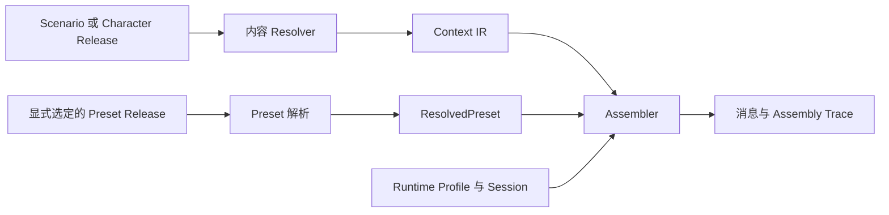

# Preset 与可复用 Prompt 内容：设计提案

状态：**历史设计提案，第一阶段及后续范围已分别由 D-159 / D-160 接续。** 生效约定见 [架构决策](../../DECISIONS.md)、[Preset 规范](../preset-v0.md) 与 [组装资产规范](../assembly-assets-v0.md)。本文保留当时的分阶段讨论；下文“后续/延后”不代表当前状态，最新范围和验收见 [执行记录](first-class-assets-rollout.md)。

本提案把一等公民讨论收敛为 Preset、Style 与 Scenario 的职责和演进路径。候选字段和行为以正式规范与 schema 的最终取值为准。

## 1. 建议结论

- 完成已有 `preset` 类型，使作者能够独立编辑、发布、引用和比较上下文组装策略。
- 第一阶段在 Preset 内提供有稳定 ID 的提示词块；不新增 `prompt`、`ruleset` 或 `examples` Creation 类型。
- Style 承载可迁移的表达风格，Scenario 承担角色、世界、关系、风格等作品的组合入口。
- Persona、Relationship 沿用现有语义，后续开放创作界面，不依靠 Preset 间接表达。
- 推荐预设与可复现的运行搭配分开表达。先保留推荐；完整搭配锁定是后续单独设计项。

一等公民应具备独立身份、发布版本、归属与许可、引用和预览能力；不意味着每种内部结构都要成为顶层作品类型。

## 2. 已有事实与约束

| 事实 | 来源与影响 |
|---|---|
| 8 种 Creation 类型已包含 Preset、Style、Scenario、Persona、Relationship | [Creation schema](../../packages/core/src/schema/creation.ts)；当前 Web 只开放 Character、World、Lorebook |
| Preset 尚无实际结构，Assembler 只接受 `preset?: undefined` | [Assembler](../../packages/assembler/src/assemble.ts)；不能把枚举存在当作功能完成 |
| Scenario 是唯一的组合 Creation，Composition 不再是一等对象 | [DECISIONS：D-020](../../DECISIONS.md)；不新增 Experience 类型 |
| `instruction` 是作者的扮演说明，属于 Creative Truth；System Prompt 属 Preset | [Canonical Model §4](../canonical-model.md)；运行策略不得伪装成普通 instruction 片段 |
| Assembler 已约定接受 `ResolvedPreset?` | [Context IR §11](../context-ir-v0.md)；Preset 属于独立的运行策略输入 |
| `recommended_presets` 是无版本作品引用，仅作推荐 | [Creation schema](../../packages/core/src/schema/creation.ts)；不能据此声称完整运行搭配已锁定 |
| Session 持有历史、记忆、状态和 late bindings | [Session](../../packages/assembler/src/session.ts)；这些内容不进入公开作品 Release |

v0 已接受的发布范围保持不变。本提案对应后续类型开放和 Preset 结构的设计，不自动将其加入当前版本验收。

## 3. 用户理解的对象边界

| 对象 | 创作者的问题 | 示例 |
|---|---|---|
| Character | 对方是谁？ | 不愿承认恐惧的调查员 |
| World / Lorebook | 世界如何运作，哪些知识需要出现？ | 城市设定、地点和组织知识 |
| Persona | 我以谁的身份参与？ | 初来城市的医生 |
| Relationship | 他们之间有什么既定关系？ | 彼此不信任的旧搭档 |
| Scenario | 谁在什么局面中相遇？ | 暴风雪封路后的旅馆聚会 |
| Style | 如何表达这部作品？ | 克制对白、有限视角、低修辞密度 |
| Preset | 如何引导模型并组织上下文？ | 主提示词、各类内容位置、预算、末尾提醒 |

同一句话可能因作者意图属于不同对象：作品限定的“叙述者只能知道当前角色看到的事情”可以是 Style 或 Scenario 内容；运行预设中的“依照所选叙事视角生成下一条回复”属于 Policy。编辑器通过对象用途引导作者，不能靠关键词准确判定文本语义。

## 4. Preset 的最小完整能力

### 4.1 身份与内容

Preset 复用 Creation 的名称、摘要、作者、许可、评级、Revision、Release 和 Contribution 生命周期。策略内容使用专门字段，不塞进 Creative `fragments` 或任意 `structured` 数据来绕过验证。

`policy` 只允许出现在 Preset 上，其全部语义内容参与规范化和 semantic digest。第一阶段 Preset 不接受 Creative fragments、cast、slots、params 或外部 references；具体空值省略与严格校验规则要与现有 Canonicalizer 一起定义。新增字段后不能沿用忽略它的旧摘要算法。

候选结构如下，**不是当前可导入的数据格式**：

```text
Creation(type = preset)
  meta / identity / provenance       沿用公共字段
  policy
    version                          策略结构版本
    blocks[]                         稳定 ID、文本、位置、启用状态
    layout[]                         内容区域的有序列表
    region_budgets{}                  可选的区域 token 上限
    requires                         必需的 Runtime 能力
```

第一阶段的块提供 main 与 after-history 两种用途。块 ID 在重命名、排序和文本修改后保持稳定，支持 Diff 与 Trace；块本身尚不是独立 Release。Preset 内的块不自动享有 system 权限，Runtime 根据能力和消费方规则决定是否接受该预设。

第一阶段不提供跨 Preset 继承、外部块引用、脚本、表达式、任意正则转换或隐藏文本替换。保存为副本可以作为编辑操作，但 UI 必须说明副本不会随原块更新，不能称为依赖复用。

### 4.2 布局和预算

- 布局复用当前 Assembler 区域，包括角色、世界、情境、知识、风格、指令、示例及 Session 区域；历史保持时间顺序。
- 第一个版本只允许在历史前后组织内容，不支持历史内部任意深度插入，也不支持将历史角色随意改写。
- 布局必须覆盖每个支持的区域且恰好出现一次；未知区域、重复区域和漏项在校验时失败。编辑器可自动补全默认布局，Canonical 输入必须明确。
- 区域内保留确定的输入顺序。一个片段不会因多个布局条目被重复注入。
- Runtime 提供 context window 和输出预留。有效输入预算先扣除原样历史、Session 内容与已启用的策略块；这些固定输入本身超预算时即失败。
- 再预留全部可见 pinned 片段所需的预算，之后才选择 normal 和 opportunistic。全局预算不足或配置的区域上限不足时显式失败，不降低 pinned 的重要性。
- 区域上限第一阶段仅适用于 Creative 片段区域；Session、history 和策略块不接受区域上限配置，也不重复扣费。每个 Creative 区域内先扣该区域 pinned 的用量，再选择其他候选。
- 其他候选先 normal、后 opportunistic，同级按固定区域顺序及 IR 顺序选择，整条纳入或整条跳过。区域上限是上限，不是预留份额。
- 历史本身超预算时由 Runtime 先整理历史，Assembler 不在背后删除消息。策略块第一阶段也不静默裁剪。

以上是候选参考算法；正式采纳时必须补充 conformance 用例，不能把当前实现偶然的排序提升为协议。

### 4.3 能力不匹配

第一阶段明确声明对 system role 和必要消息布局能力的需求。遇到不支持的 Runtime，应返回可解释的不兼容结果；不得无提示地把 system 指令改成用户发言。用户可以显式选择其他兼容预设或默认布局。

采样参数、服务地址、认证信息和模型连接管理仍归 Runtime。Preset 可展示适用说明；是否另加结构化模型建议不进入本次最小范围。

## 5. 解析、锁定与 Trace



内容图和策略输入分别保留身份。切换 Preset 不改写内容 IR 的 lock 或 Creative Truth；发布、读取与权限检查仍由 Registry 负责，纯计算层不联网取依赖。

候选 `ResolvedPreset` 至少携带 `ref`、精确 Release、semantic digest、策略结构版本、解析器版本及规范化策略。第一阶段没有策略依赖，因此不构造无用途的第二张依赖图。若未来增加模块引用，必须先定义独立策略锁、循环检测和同一作品多版本冲突规则。

Preset 解析阶段需对加载的发布快照重新规范化并校验 semantic digest，再生成 ResolvedPreset；仅携带调用方声明的摘要字符串不构成完整性验证。摘要验证也不能替代 Registry 的访问授权和发布状态检查。

Assembly Trace 增加实际使用的 Preset 身份；块以 `preset:*` 标记并关联来源。仍需保留每个 Creative 片段的纳入或舍弃原因，以及预算估算标记。默认布局也需要可识别的实现版本，才能解释“未选 Preset”的行为差异。

可复现组装需要同时固定内容 IR、Preset、Session 输入、Runtime Profile、Assembler 版本与 tokenizer；固定这些不保证模型生成相同文本。

## 6. Scenario 作为组合入口

沿用现有 cast、Reference Edge、bindings、params 和精确 Release pin 来组合创作内容。现有 early cast 对象必须能够在已锁定引用图中找到；late Persona 由 Runtime 的 Session 绑定。

“雨夜旅馆”可以组合世界、角色阵容、关系、知识与风格，并推荐一个悬疑 Preset。用户看到的作品页分别呈现：

- 本作品已经锁定的内容依赖及其版本；
- 推荐使用但可以替换的 Preset；
- 需要 Runtime 提供的玩家身份等输入。

推荐不自动启用，也不自动解析为 latest 后声称是作者原搭配。Runtime 真正选用时记录具体 Release。

如果未来要求作者发布“可完全复现的搭配”，需另行定义带精确策略引用的组装清单，可作为 Scenario 关联配置或 Runtime 导出记录；它不直接升级为新的 Creation 类型。该扩展要处理角色资料、Session 隐私、策略版本和兼容性，不能仅把 `recommended_presets` 改成依赖。

## 7. Prompt Module 的演进条件

第一阶段让作者编写、排序和比较 Preset 内的块，验证真实使用方式。出现以下需求时，再评审独立 Prompt Module：

1. 同一模块需要在多个 Preset 中保持引用，而非复制文本。
2. 模块作者和 Preset 作者需要独立署名、许可与发布周期。
3. 消费者需要固定模块版本，并单独查看升级差异。

若成立，独立模块应属于 Policy 域，不复用 Creative `instruction` 的含义。要比较“新增模块 Creation 类型”和“引用另一个 Preset 的公开块”两种方案；前者提供独立生命周期，后者减少顶层类型但让块版本依附整个 Preset。当前证据不足以替用户决定。

Rule Set 与 Example Pack 先作为用途或模板，不分别新增类型。声明式规则不意味着平台负责执行游戏规则、维护数值状态或保证模型遵守文本约束。

## 8. 作者预览与验收场景

作者预览应并排解释内容来源和策略来源，展示实际顺序、token 预算、跳过原因与兼容性结果；这些信息属于创作工作区，不要求普通读者理解 IR。

| 场景 | 预期结果 |
|---|---|
| 同一内容切换两个 Preset | 内容 IR 身份不变，实际布局与策略 Trace 改变 |
| 修改块文本或排序 | Preset 新 Release，旧 Release 可继续复现 |
| 没有选 Preset | 使用可识别版本的默认布局 |
| per-agent 消费遇到他人的 private 内容 | 先按可见性排除，Preset 不能重新注入该片段 |
| narrator 消费 private 内容 | 按现有规范标注知情者，不宣称模型内存在安全隔离 |
| pinned 或启用策略块超过输入预算 | 明确失败，不悄悄截断 |
| Preset 要求 Runtime 不具备的能力 | 展示不兼容及原因，不静默改变消息语义 |
| 同一作品被推荐不同 Preset | 推荐与实际选用分别展示；Trace 记录实际版本 |
| 导入 CCv3 含 system / post-history 字段 | 保持现有遗漏报告；后续独立 Preset 导入须经作者明确选择 |

## 9. 实施顺序与评审点

建议分三步，每步单独验收：

1. **定义并实现 Preset 核心**：确认 Canonical policy、ResolvedPreset、预算与能力规则，更新规范、schema、校验、组装、Trace 和跨 Runtime 用例；默认布局行为须保持可解释的兼容性。
2. **开放创作者完整路径**：核对 Registry 发布完整性、权限和索引，提供创建、编辑、发布、预览、Diff 与导出；有类型枚举不等于这些路径自然可用。同步考虑 Style 编辑入口。
3. **完善 Scenario 组合体验**：展示精确内容依赖和 Preset 推荐，后续再决定完整运行搭配锁定、独立模块及其他创作类型的开放。

第一阶段的评审结果：

- 第一阶段不增加 Prompt Module 类型，提供 Preset 内部块。
- 保留推荐 Preset，完整运行搭配锁定另行设计。
- 先实现协议与参考实现，Web 创作、发布与预览路径后续接入。

上述阶段范围已记录于 DECISIONS；本文未进入第一阶段的建议不构成后续交付承诺。
